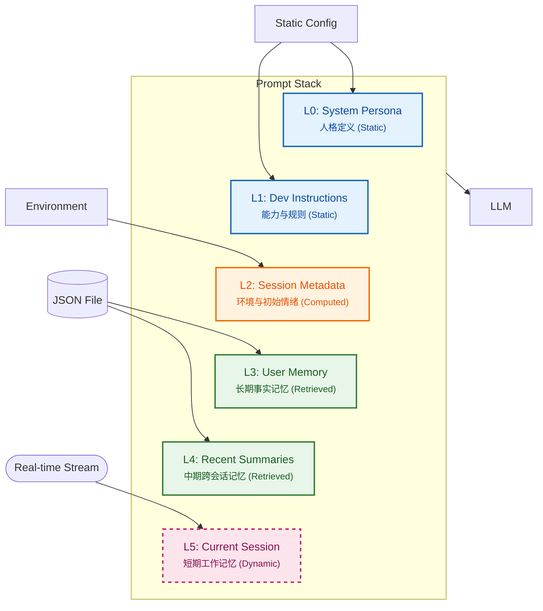

import Tabs from '@theme/Tabs';
import TabItem from '@theme/TabItem';

`assistant-agent` (项目代号 `Subaru`) 是一个面向 DM 的私人 LLM 助理插件。这篇文章整理了它的核心设计：如何用分层上下文 + 记忆系统 + 情绪建模，让它更像一个“长期陪伴的赛博伙伴”，而不是一次性问答工具。

<!-- truncate -->

:::info 核心愿景
Subaru 不应该只是一个待命的搜索框。她应该像一个坐在你身边的朋友：她应该像一个坐在用户身边的朋友，能够感知情境、记住重要事情、拥有自己的情绪和个性、主动发起对话，并在需要时为用户提供帮助和陪伴。
:::

## 多层上下文结构

为了让 LLM 拥有“连贯的人格”和“长期的记忆”，每次当一个新的“会话记录 (Session Record)”开始时，系统会构建这个完整的上下文 Prompt Stack，并将其提供给 LLM。

<div style={{textAlign: 'center', marginBottom: '20px'}}>


</div>

<Tabs>
  <TabItem value="stack overview" label="Prompt Stack" default>

    | 层级 | 组件名称 | 职责与内容 | 
    | :--- | :--- | :--- | 
    | **L0** | **System Persona** | **人格定义**：定义核心性格、价值观和说话风格。 | 
    | **L1** | **Developer Instructions**| **规则与能力**：定义 LLM 的操作手册，包括工具使用、回复行为和情绪模型。 | 
    | **L2** | **Session Metadata** | **环境感知**：提供对话的初始情境，包括时间、用户活跃度和初始情绪。 | 
    | **L3** | **User Memory (Facts)** | **长期核心记忆**：存储关于用户的稳定事实。 | 
    | **L4** | **Recent Summaries** | **中期情景记忆**：存储过去会话记录的摘要，提供跨会话的连贯性。 | 
    | **L5** | **Current Session Record**| **短期工作记忆**：当前会话的完整、原始消息流。 | 

    除了 **L5** 是随对话实时更新的，**L0-L4** 在当前会话中都是静态计算的，保证 KV Cache 和上下文的稳定性。
  </TabItem>
  <TabItem value="l01" label="灵魂与规则" default>
    这部分是 Subaru 的基石，通常是静态的 Prompt。

    - **L0: System Persona (系统人格)**
      - 专注于定义“她是谁”。例如：*“外表冷静，内心温柔，珍视承诺”*。
      - **设计原则**：保持纯粹，不混入功能指令，防止人格被工具属性污染。

    - **L1: Developer Instructions (开发者指令)**
      - LLM 的操作手册。定义了工具使用、情绪模型理解、以及特殊控制符（如 `<SILENCE>`, `<WANT_MORE>`）的触发条件。
  </TabItem>
  <TabItem value="l2" label="环境感知">
    L2: 为了让 AI 拥有时间感和现实感，我们在这一层注入元数据：

    ```json
    {
      "session_start": "2025-12-30T10:00:00",
      "time_since_last_message": "~12 hours",
      "user_activity": "Active 5 days in the last 7",
      "initial_mood": { "valence": 0.5, "arousal": -0.1 }
    }
    ```
    
    *Subaru 会知道你是不是“好久不见”，也会根据上次对话的情绪衰减计算出今天的“初始心情”。*
  </TabItem>
  <TabItem value="l34" label="记忆系统">
    - **L3: User Memory/Facts (长期核心记忆)**
      - 存储关于用户的稳定事实，如 *“User is allergic to peanuts”*。
      - 采用 LRU  策略，上限 30 条，自动遗忘不重要的旧事。

    - **L4: Recent Summaries (中期情景记忆)**
      - 解决“我们上周聊了啥”的问题。
      - 存储过去 N 个会话的摘要，每个摘要都带有 `RecordID`，支持精确回溯。
  </TabItem>
  <TabItem value="l5" label="短期工作记忆">
    - **Current Session Record**
    - 保存当前会话的**完整、原始**消息流。
    - **滑动窗口**：当超过 Token 上限，旧消息被移除，但 L0-L4 始终保持，确保人格不崩塌。
    - **边界判定**：消息间隔 > 10 min，自动开启新 Session。
  </TabItem>
</Tabs>

---

## 情绪与行为模型

Subaru 不仅仅是回复文本，她有自己的“心理状态”。

### 二维 V-A 情绪模型

我们采用了心理学上的 **Valence-Arousal (效价-唤醒度)** 模型来量化情绪。

- **Valence (-1.0 ~ +1.0)**: 情绪的好坏（如：开心 vs 难过）。
- **Arousal (-1.0 ~ +1.0)**: 情绪的能量（如：兴奋 vs 困倦）。

:::tip 情绪不是静止的
新会话开始时，情绪会通过 **指数衰减公式** 向基准值回归。

$$ 
Initial = Baseline + (Last - Baseline) \times e^{-k \cdot \Delta t} 
$$

这意味着，如果上次她很生气，过了两天你再找她，她可能已经消气了（回归平静），而不是一上来就继续发火。
:::

import { useState } from 'react';

<details>
  <summary>查看 V-A 情绪坐标示例</summary>

{/* 定义数据源：新增了 愤怒、悲伤、满足 */}
export const moodData = [
  { v: 0.8, a: 0.8, label: "兴奋", sub: "激动", desc: "高正向 / 高唤醒", color: "#ff9f43" },
  { v: 0.2, a: -0.4, label: "平静", sub: "放松", desc: "正向 / 低能量", color: "#1dd1a1" },
  { v: -0.4, a: 0.7, label: "焦虑", sub: "紧张", desc: "负向 / 高唤醒", color: "#ff6b6b" },
  { v: -0.2, a: -0.5, label: "倦怠", sub: "无聊", desc: "负向 / 低能量", color: "#54a0ff" },
  { v: -0.7, a: 0.8, label: "愤怒", sub: "恼火", desc: "高负向 / 高唤醒", color: "#d63031" }, 
  { v: -0.7, a: -0.3, label: "悲伤", sub: "沮丧", desc: "负向 / 偏低唤醒", color: "#a29bfe" },
  { v: 0.5, a: -0.1, label: "满足", sub: "安心", desc: "稳定正向 / 适中", color: "#feca57" },
];

{/* 交互组件定义 */}
export const MoodChart = () => {
  const [hovered, setHovered] = useState(null);

  return (
    <div style={{
      position: 'relative',
      width: '100%',
      maxWidth: '500px',
      aspectRatio: '1/1',
      margin: '2rem auto',
      backgroundColor: 'var(--ifm-background-surface-color)',
      border: '1px solid var(--ifm-color-emphasis-300)',
      borderRadius: '16px',
      boxShadow: '0 8px 24px rgba(0,0,0,0.08)',
      overflow: 'visible', // 允许 Tooltip 超出边界
      fontFamily: 'var(--ifm-font-family-base)'
    }}>
      {/* --- 背景坐标轴 --- */}
      <div style={{position:'absolute', top:'50%', left:'6%', right:'6%', borderTop:'1px dashed var(--ifm-color-emphasis-400)'}}></div>
      <div style={{position:'absolute', left:'50%', top:'6%', bottom:'6%', borderLeft:'1px dashed var(--ifm-color-emphasis-400)'}}></div>
      
      {/* 坐标轴文字 */}
      <span style={{position:'absolute', top:'10px', left:'50%', transform:'translateX(-50%)', fontSize:'10px', fontWeight:'bold', color:'var(--ifm-color-emphasis-600)'}}>High Arousal (+1.0)</span>
      <span style={{position:'absolute', bottom:'10px', left:'50%', transform:'translateX(-50%)', fontSize:'10px', fontWeight:'bold', color:'var(--ifm-color-emphasis-600)'}}>Low Arousal (-1.0)</span>
      <span style={{position:'absolute', left:'10px', top:'50%', transform:'translateY(-50%) rotate(-90deg)', fontSize:'10px', fontWeight:'bold', color:'var(--ifm-color-emphasis-600)'}}>Negative (-1.0)</span>
      <span style={{position:'absolute', right:'10px', top:'50%', transform:'translateY(-50%) rotate(90deg)', fontSize:'10px', fontWeight:'bold', color:'var(--ifm-color-emphasis-600)'}}>Positive (+1.0)</span>

      {/* 中心点 */}
      <div style={{position:'absolute', left:'50%', top:'50%', width:'8px', height:'8px', background:'var(--ifm-color-emphasis-400)', borderRadius:'50%', transform:'translate(-50%, -50%)'}} />

      {/* --- 渲染情绪点 --- */}
      {moodData.map((m, idx) => {
        const isHovered = hovered === idx;
        const left = (m.v + 1) / 2 * 100 + '%';
        const bottom = (m.a + 1) / 2 * 100 + '%';
        
        return (
          <div 
            key={idx}
            onMouseEnter={() => setHovered(idx)}
            onMouseLeave={() => setHovered(null)}
            style={{
              position: 'absolute',
              left: left,
              bottom: bottom,
              transform: 'translate(-50%, 50%)', // 修正坐标中心
              cursor: 'pointer',
              zIndex: isHovered ? 10 : 1, // 悬浮时层级最高
              display: 'flex',
              flexDirection: 'column',
              alignItems: 'center',
              transition: 'all 0.3s cubic-bezier(0.175, 0.885, 0.32, 1.275)'
            }}
          >
            {/* 1. 圆点主体 */}
            <div style={{
              width: isHovered ? '20px' : '14px',
              height: isHovered ? '20px' : '14px',
              borderRadius: '50%',
              backgroundColor: m.color,
              border: '2px solid #fff',
              boxShadow: isHovered ? `0 0 15px ${m.color}` : `0 0 5px ${m.color}`,
              transition: 'all 0.3s ease'
            }} />

            {/* 2. 静态标签 (未悬浮时显示简略，悬浮时隐藏以显示详细 Tooltip) */}
            <span style={{
              opacity: isHovered ? 0 : 1,
              marginTop: '6px',
              fontSize: '12px',
              fontWeight: '600',
              color: 'var(--ifm-color-content)',
              textShadow: '0 1px 2px var(--ifm-background-color)',
              pointerEvents: 'none',
              transition: 'opacity 0.2s'
            }}>
              {m.label}
            </span>

            {/* 3. 悬浮 Tooltip (仅悬浮显示) */}
            <div style={{
              position: 'absolute',
              bottom: '25px', // 在点上方
              opacity: isHovered ? 1 : 0,
              transform: isHovered ? 'scale(1)' : 'scale(0.8)',
              pointerEvents: 'none',
              backgroundColor: 'rgba(0, 0, 0, 0.85)',
              backdropFilter: 'blur(4px)',
              color: '#fff',
              padding: '8px 12px',
              borderRadius: '8px',
              width: '160px',
              textAlign: 'center',
              fontSize: '12px',
              transition: 'all 0.2s ease',
              boxShadow: '0 4px 12px rgba(0,0,0,0.2)',
              zIndex: 20
            }}>
              <div style={{fontWeight:'bold', fontSize:'14px', marginBottom:'4px', color: m.color}}>
                {m.label} <span style={{opacity:0.8, fontSize:'12px'}}>({m.sub})</span>
              </div>
              <div style={{marginBottom:'4px', color:'#eee'}}>{m.desc}</div>
              <div style={{fontFamily:'monospace', fontSize:'10px', opacity:0.6, background:'rgba(255,255,255,0.1)', borderRadius:'4px', padding:'2px'}}>
                V: {m.v > 0 ? '+'+m.v : m.v}, A: {m.a > 0 ? '+'+m.a : m.a}
              </div>
              {/* 小三角箭头 */}
              <div style={{
                position: 'absolute',
                bottom: '-5px',
                left: '50%',
                transform: 'translateX(-50%)',
                width: 0, height: 0,
                borderLeft: '5px solid transparent',
                borderRight: '5px solid transparent',
                borderTop: '5px solid rgba(0, 0, 0, 0.85)'
              }} />
            </div>

          </div>
        );
      })}
    </div>
  );
};

<MoodChart />

</details>

### 拒绝回复与主动行为

为了更像真人，Subaru 拥有拒绝和主动的权利。

*   **`<SILENCE>` (已读不回)**: 当情绪 Valence 过低且用户输入具有攻击性时，LLM 输出此 Token。前端界面不显示任何回复。这赋予了她“生气”的权利。
*   **`<WANT_MORE>` (续写)**: 类似于人说话时的喘气。如果她觉得意犹未尽，会输出此 Token，系统自动追加 `(you want to say more)` 让其继续生成。
*   **`<PROACTIVE>` (主动对话)**:
    Subaru 可以在对话结束时决定“过一会儿再找你”。
    ```json
    <PROACTIVE>{"delay_seconds":180, "reason":"Share the song I just mentioned"}
    ```
    后台服务会将此请求加入队列，到时间后若用户未进行新操作，Subaru 会主动发起新会话。

---

## 工具与异步服务

为了保证主线程的极速响应，繁重的记忆整理工作全部在后台异步完成。

### 关键组件

1.  **FactEngine (事实引擎)**
    - 全生命周期管理 L3 记忆。
    - 不仅提取新事实，还会分析用户当前提到了哪些旧事实，  
    更新其 `LastAccessedAt` 时间戳，确保常用记忆不被 LRU 策略淘汰。

2.  **SummaryGenerator (摘要生成器)**
    - 会话结束（10分钟无操作）后触发，管理 L4 记忆。
    - 将几百条消息压缩为一句话摘要，存入 L4，供未来检索。

### 可用工具

1. **RecordSearch**

    - 基于 `RecordID` 的精确上下文回溯。这允许 Subaru 在 L4 看到“上次聊过项目 deadline”的摘要后，调用此工具读取那次对话的完整细节，而不是仅仅依靠模糊的幻觉。
    - 在模型给出回复后，将 `Session Record` 文本从上下文中用占位符 `[Session Record xxx has read]` 标记替换，避免上下文过长。

2. **HistorySearch**

    - 当需要关键词搜索回顾过去某段具体对话的细节时调用，基于关键词的模糊检索。
    - 返回该 `keyword` 对应的 10 条消息本文以及对应的 `Session Record ID`，如有需要可以继续使用 `RecordSearch` 工具进行更精确的查找。