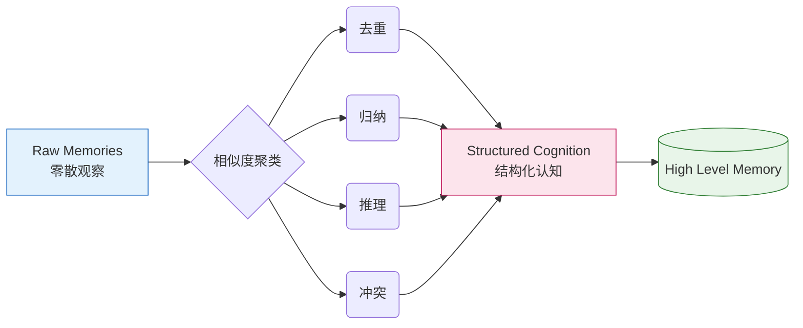

import Tabs from '@theme/Tabs';
import TabItem from '@theme/TabItem';

`assistant-agent`（项目代号 `Subaru`）的 L3 用户事实记忆（Facts）在最初版本里使用了类似 LRU 的淘汰策略：只要近期没有被访问，就会被挤出固定长度的数组。

这对“计算机缓存”很合理，但对“人类记忆”很不合理。

<!-- truncate -->

:::info 为什么要改
1. 用户告诉 Agent：“我叫小明。”（这是第 1 条记忆）
2. 随后两人聊了 500 句无关紧要的家常（产生 500 条新记忆）。
3. 数组满了，LRU 把头部的“我叫小明”删掉了。
4. Agent：“不好意思，你是谁？”
:::

为了解决这个问题，我们在 Subaru 的记忆系统中引入了「遗忘曲线」和「整理机制」。

## 记忆的三大支柱

人类的记忆不仅仅关乎“最近发生了什么”，它由三个核心指标共同决定：

1.  **Recency**    $R$：刚刚发生的事情记得清楚（LRU 只做到了这一点）。
2.  **Importance** $I$：平淡的琐事容易忘，重大的变故记得久。
3.  **Frequency**  $F$：经常被提起的记忆会加固。

## 记忆遗忘曲线

我们基于**广义双曲线衰减**设计了一个保留分数公式 ($Score$)。当记忆数组满时，系统不再单纯删除最旧的，而是删除 $Score$ 最低的。

$$
Score = \frac{S}{(1 + t)^{\alpha}}
$$

其中：

*   **Strength** $S$：记忆的原始强度，由重要性和频率决定：$S = \text{I} \cdot [1 + \ln(\text{F})]$。
*   **Time** $t$：距离当下的时间间隔（由 $R$, 即数组 Index 映射而来）。
*   **Decay Rate** $\alpha$：衰减系数（取 0.5），模拟人脑的自然遗忘率。

<details>
  <summary>为什么频率使用自然对数 ln(F) ?</summary>
  
  心理学表明重复带来的增强效果是边际递减的。
  
  - 第 1 次出现 ($F=1$)：$1 + 0 = 1$ 倍加成。
  - 第 3 次出现 ($F=3$)：$1 + 1.1 \approx 2.1$ 倍加成。
  - 第 10 次出现 ($F=10$)：$1 + 2.3 \approx 3.3$ 倍加成。
  
  即使一句废话被提了 100 次，也不应该比“我叫什么名字”更重要。
</details>

### 记忆评分标准

为了量化 Importance，我们制定了一套 1-10 分的评分标准。

| 评分 | 颜色 | 含义 | 示例 |
| :--- | :--- | :--- | :--- |
| **1-2** | 🟢 | **琐碎信息**：仅对当前对话有意义。| "早饭吃了面包", "今天天气不错" |
| **3-4** | 🔵 | **短期状态**：几天内有用，随时间迅速贬值。| "今晚去跑步", "想买个耳机" |
| **5-6** | 🟡 | **一般偏好**：长期习惯与非核心属性。| "不吃辣", "喜欢足球", "惯用左手" |
| **7-8** | 🟠 | **重要事实**：定义用户生活框架的关键事实。| "程序员", "住在北京", "有女朋友" |
| **9-10**| 🔴 | **核心身份**：绝对不能遗忘的“死线”信息。| "我叫Alex", "花生过敏", "刚丧偶" |

:::tip 打分策略
LLM 在判断时遵循**保守原则**：如果不确定是 6 还是 7，选 6，避免高分通胀。除非用户显式指令“记住...”，否则不轻易给 10 分。
:::

## 记忆整理机制

**每天定时触发记忆整理**，模拟人类通过做梦将白天的短期记忆转化为长期记忆。

核心逻辑是将“零散的观察”变成了“结构化的认知”。

<div style={{textAlign: 'center', marginBottom: '20px'}}>


</div>

<Tabs>
  <TabItem value="dedupe" label="去重 (Deduplication)" default>
    **逻辑**：内容相同，合并 Frequency，释放空间。

    - 🧠 **记忆A**：“我喜欢吃苹果”
    - 🧠 **记忆B**：“爱吃苹果”
    - ✅ **结果**：“喜欢吃苹果” (Frequency +1)
  </TabItem>
  <TabItem value="generalize" label="归纳 (Generalization)">
    **逻辑**：将具体的低重要性琐事，提炼为抽象的高重要性偏好。

    - 🧠 **记忆A**：“周一去吃了日料” (Score: 3)
    - 🧠 **记忆B**：“周三点了寿司外卖” (Score: 3)
    - 🧠 **记忆C**：“很喜欢吃刺身” (Score: 5)
    - ✅ **结果**：“用户非常偏爱日本料理，特别是寿司和刺身。” (Score: 6)
  </TabItem>
  <TabItem value="inference" label="推理 (Inference)">
    **逻辑**：将孤立的事实串联成更有意义的人物画像。

    - 🧠 **记忆A**：“住在北京”
    - 🧠 **记忆B**：“抱怨雾霾严重”
    - ✅ **结果**：“住在北京，对空气质量敏感，不喜欢雾霾。”
  </TabItem>
  <TabItem value="conflict" label="冲突 (Conflict)">
    **逻辑**：不能简单地基于时间删除旧的，因为“变化本身”也是重要的记忆。

    - 🧠 **记忆A**：“在 Google 工作” (t=1年)
    - 🧠 **记忆B**：“在 Meta 工作” (t=现在)
    - ✅ **结果**：“曾在 Google 工作，现跳槽至 Meta 工作。”
  </TabItem>
</Tabs>

### 整理后的数据结构示例

经过一夜的“睡梦整理”，Subaru 的后台日志会输出如下结构：

```json
[
  {
    "type": "Conflict",
    "source_memories": [
      {"id": "F1a2b", "content": "用户居住在上海"},
      {"id": "F0f3c", "content": "搬家到了杭州，入职阿里"}
    ],
    "reasoning": "检测到居住地变更，保留变迁历史以维持上下文连贯性，赋予极高重要性。",
    "new_memory": "用户曾居住在上海，近期已搬迁至杭州并入职阿里。",
    "importance": 9
  },
  {
    "type": "Inference",
    "source_memories": [
      {"id":"F9c0d", "content": "正在自学 Python 编程"},
      {"id":"F12ef", "content": "还是学不会 Python 的类继承"}
    ],
    "reasoning": "将学习目标与当前痛点串联。",
    "new_memory": "正在自学 Python（目前在类继承概念上遇到困难）。",
    "importance": 7
  }
]
```
