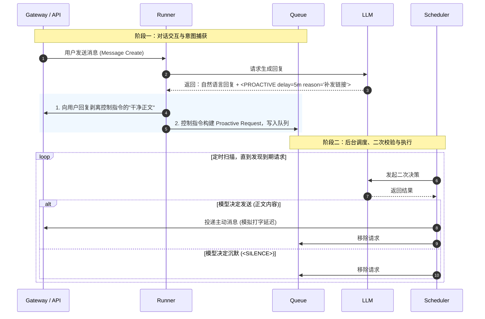

import Tabs from '@theme/Tabs';
import TabItem from '@theme/TabItem';

`assistant-agent` (项目代号 `Subaru`) 在“被动问答”之外，还需要一种更像真人的能力：在合适的时刻，主动回来找你。这不是简单的“定时提醒”，而是一个贯穿「模型输出 → 调度 → 二次决策 → 消息投递」的端到端系统。

<!-- truncate -->

:::info 核心愿景
主动对话的设计目标是让 Subaru 具备**可解释的触发**能力，每一次跟进都必须能回答“为什么要找用户”。同时，系统必须具备**可撤销性**，当用户已经继续对话或话题变更时，能够克制地放弃打扰。
:::

## 两段式决策

主动对话容易做错的原因是：**你无法在未来预测“到点时的真实上下文”**。因此，Subaru 将其拆分为两个独立的决策阶段：

1.  **意图阶段 (Intent)**：在正常对话中，模型提出一个“跟进意图”（包含延迟与原因），系统将其记录到队列。此阶段成本低、频次高。
2.  **执行阶段 (Execution)**：时间到后，系统重建“当前上下文”，让模型进行二次决策（发或不发），并生成最终消息。此阶段必须谨慎、稀缺。

<div style={{textAlign: 'center', marginBottom: '20px'}}>


</div>

---

## 协议与数据模型

为了实现工程上的可控性，我们将“想法”从自然语言中剥离，转化为结构化的控制指令。

<Tabs>
  <TabItem value="protocol" label="触发协议" default>
    在 Subaru 的体系里，“主动跟进”通过一个**单行控制指令**表达。
    
    - **格式**：`<PROACTIVE>JSON_PAYLOAD`
    - **示例**：
      ```json
      <PROACTIVE>{"delay_seconds": 300, "reason": "补发刚才提到的歌曲链接"}
      ```
    
    :::tip 隐式与显式
    用户看到的是剥离了指令的自然语言回复，而系统读到的是结构化意图。这保证了前端体验的自然，同时确保后台能稳定解析、重试和限流。
    :::
  </TabItem>
  <TabItem value="model" label="数据模型">
    一条 **Proactive Request** 需要同时承载语义和工程状态：

    | 字段 | 类型/含义 | 设计要点 |
    | :--- | :--- | :--- |
    | `id` | Unique ID | 唯一标识。 |
    | `added_at` | Timestamp | 请求入队时间，用于回放“当时的对话”。 |
    | `request_at` | Timestamp | 预期执行时间。由 delay 计算得出，需做边界夹紧。 |
    | `reason` | String | **跟进原因**。既是生成时的理由，也是执行时的约束。 |
    | `record_id` | Ref ID | 触发时对应的会话记录 ID，避免凭空猜测。 |
    | `channel_id` | Ref ID | 确保消息回到正确的聊天位置。 |
    | `attempts` | Integer | 已尝试次数，控制重试上限。 |
  </TabItem>
</Tabs>

---

## 端到端生命周期

### 1. 正常对话阶段
当用户与 Subaru 对话时：
1.  系统从回复末尾解析 `<PROACTIVE>` 指令。
2.  构建 Request 对象：将 delay 转换为绝对时间 `request_at`（过短或过长的 delay 会被系统强制夹紧）。
3.  **入队不等于承诺发送**：这只是在说“我可能想跟进”。

### 2. 后台调度阶段
后台服务以固定间隔（轻量定时器）轮询：
1.  枚举已知用户。
2.  扫描 `request_at <= now` 的请求。
3.  一旦发现，进入执行流程。

### 3. 决策执行阶段
这是系统最核心的逻辑。系统会尽量补齐三类上下文提供给 LLM：
- **当时的上下文** (`record_id`)：回放触发请求时的那次会话。
- **中间会话摘要** (`summaries`)：如果中间发生过对话，加载其摘要。
- **当前的上下文** (`current_record`)：用户最近的实时会话状态。

LLM 基于这些信息进行**二选一**：
*   **发送**：输出一条自然语言消息（禁止再包含控制指令）。
*   **沉默**：输出 `<SILENCE>`，系统将移除该请求。

<details>
  <summary>查看执行阶段的 Prompt 示例</summary>

```text
You may send ONE proactive message to the user, or decide to send nothing.

Rules:
- If you decide to send nothing, output exactly <SILENCE> and nothing else.
- If you decide to send, output only the message content (no <WANT_MORE> / <PROACTIVE> directives, no final_mood line).
- Avoid repeating what was already discussed; do not interrupt if the user already continued the topic.
===

Scheduling context:
- now: 2026-01-13T11:40:12+08:00
- reason: 补发刚才提到的歌曲链接
- record_id: record_8f3c2a

Scheduled session record (when the request was created):
[msg_001] 2026-01-13T11:34:12+08:00 user_amy: 你刚刚说的那首歌叫什么？
[msg_002] 2026-01-13T11:34:30+08:00 Subaru: 叫《XXX》，我很喜欢它的副歌。
[msg_003] 2026-01-13T11:34:45+08:00 user_amy: 发我一下链接？
[msg_004] 2026-01-13T11:34:58+08:00 Subaru: 好，我整理一下，等会儿发你。

Session summaries between the scheduled request and now:
S12 [2026-01-13T11:36:20+08:00] (RecordID=record_8f3c2a): 用户请求歌曲链接，Subaru 承诺稍后发送。
S13 [2026-01-13T11:39:10+08:00] (RecordID=record_9b1d77): 用户又发了一句“在吗？”，开始了新的会话。

Recent current session record:
[msg_101] 2026-01-13T11:39:05+08:00 user_amy: 在吗？
[msg_102] 2026-01-13T11:39:12+08:00 Subaru: 我在，怎么啦？
```
</details>

### 4. 可靠发送阶段
必须处理发送失败：
- **拟人化延迟**：根据生成的文本长度计算打字时间（WPM 设置），模拟真人节奏。
- **失败重试**：发送失败时保留请求，更新 `last_attempt_at` 并增加 `attempts` 计数，直到达到重试上限。

---

## “克制”机制：何时放弃？

主动消息最重要的不是“能发”，而是“知道什么时候别发”。以下情况系统倾向于丢弃请求：

1.  **用户已经继续对话**：Context 显示用户在 `request_at` 之后已主动发言，且话题已切换。
2.  **话题已解决**：中间摘要 (`Summaries`) 显示该事项已在后续对话中完成。
3.  **理由不充分**：`reason` 过于空泛（如“想跟你聊聊”）。目前策略倾向于只允许“明确跟进”类任务（补链接、补资料、提醒）。
4.  **时间窗口过期**：跟进本身具有时效性（例如“我一会儿把链接发你”），过久反而尴尬。