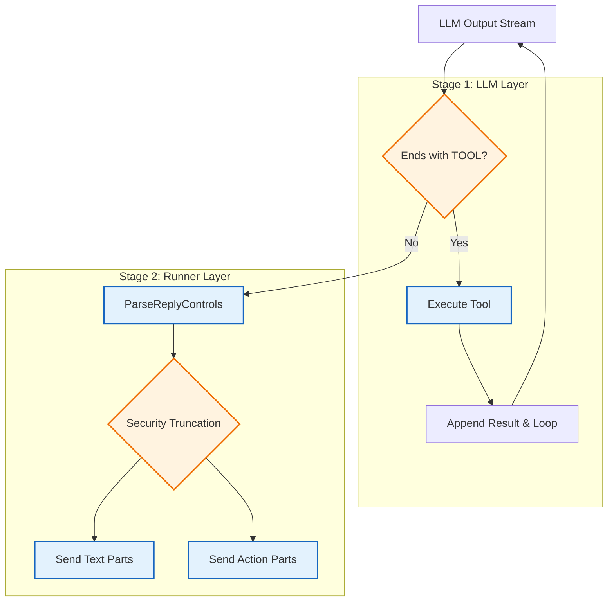

import Tabs from '@theme/Tabs';
import TabItem from '@theme/TabItem';

`assistant-agent` (项目代号 `Subaru`) 的回复不仅仅是自然语言文本。为了实现“既能聊天，又能做事”的能力，我们设计了一套控制指令协议。

这些指令将“要做什么”从“要说什么”中剥离出来，交给 Runner 系统执行：无论是发送贴纸、投递语音、调用工具，还是在后台静默排队。本文将详解这套协议的格式、解析逻辑及安全截断机制。

<!-- truncate -->

## 协议定义

所有的控制指令均采用 `Token + JSON Payload` (或纯 Token) 的形式。

<Tabs>
  <TabItem value="list" label="指令列表" default>
    | 指令 Token | 出现位置 | 语义与作用 |
    | :--- | :--- | :--- |
    | `<SILENCE>` | 尾部 | **保持沉默**。表示本次对话不发送任何文本消息。 |
    | `<WANT_MORE>` | 尾部 | **意犹未尽**。表示模型话没说完，系统需自动触发一次续写请求 (Continue Generation)。 |
    | `<PROACTIVE>` | 任意 | **主动跟进**。将一个延时任务推入后台队列，例如“5分钟后提醒用户”。 |
    | `<STICKER>` | 任意 | **发送贴纸**。支持插入到正文中间，实现图文混排。 |
    | `<VOICE>` | 任意 | **语音合成**。触发 TTS 服务发送语音消息。 |
    | `<TOOL>` | 尾部 | **工具调用**。触发 Function Calling 循环。 |
    | `final_mood:` | 尾部 | **情绪输出**。用于更新记忆系统的情绪状态。 |
  </TabItem>
  <TabItem value="schema" label="Payload 结构">
    ```typescript
    // <PROACTIVE>
    // 允许 AI 决定在未来某个时间点主动发起新会话
    type ProactiveDirective = {
      delay_seconds: number; // 延迟秒数
      reason: string;        // 唤起原因（用于构建新 Prompt）
    }

    // <STICKER>
    // 映射到前端具体的贴纸资源
    type StickerDirective = {
      name: string;
    }

    // <VOICE>
    // 独立的 TTS 文本轨道
    type VoiceDirective = {
      text: string;
    }

    // <TOOL>
    // 经典的工具调用结构
    type ToolDirective = {
      name: string;
      args: Record<string, unknown>;
    }
    ```
  </TabItem>
</Tabs>

---

## 解析管道

Subaru 的输出流处理分为两个阶段：**LLM 层的工具循环** 和 **Runner 层的消息投递**。

<div style={{textAlign: 'center', marginBottom: '20px'}}>


</div>

### 工具循环

在 `ChatWithTools` 层面，系统**只关注**位于消息尾部的 `<TOOL>` 指令。
*   如果检测到 `<TOOL>`，立即拦截，执行工具逻辑，将 `<tool_result>` 追加到上下文并让 LLM 继续生成。
*   这意味着 `<TOOL>` 绝不应该出现在正文中间。如果出现，会被视为异常（见下文截断保护）。

### 混合流解析

当 LLM 决定不再调用工具并输出最终回复时，Runner 的 `ParseReplyControls` 介入：

1.  **位置敏感性**：
    与工具不同，`<STICKER>`, `<PROACTIVE>`, `<VOICE>` 被允许出现在文本的任何位置。
    
2.  **图文混排**：
    旧策略是“先发完文字，再发贴纸”。新策略将回复解析为 `Parts` 序列，按顺序执行。
    
    > **示例输出**：
    > `哈哈，太好笑了！`  
    > `<STICKER>{"name":"Laugh"}`  
    > `你居然能想到这个。`
    
    **用户视角的接收顺序**：
    1. 收到文本：*"哈哈，太好笑了！"*
    2. 收到贴纸：*[大笑表情]*
    3. 收到文本：*"你居然能想到这个。"*

:::tip 贴纸降频 (Sticker Throttling)
为了防止 Subaru 变成“表情包刷屏怪”，发送逻辑中包含一个随机拦截器 (`AssistantStickerSendProbability = 0.7`)。约 30% 的贴纸请求会被静默丢弃，但这不影响前后的文字流畅度。
:::

---

## 安全与稳定性设计

为了防止 LLM 抽风导致协议泄漏，我们实施了严格的输入/输出清洗。

### 输出侧

LLM 偶尔会产生幻觉，把本该在结尾的指令写到中间。为了防止这些“系统噪音”发给用户，`ParseReplyControls` 实施硬截断保护策略。

当流中检测到以下 Token 时，该 Token 及其之后的所有内容会被立即丢弃：

*   `<SILENCE>`
*   `<WANT_MORE>`
*   `<TOOL>` / `</TOOL>`
*   `final_mood:`

这意味着，如果模型输出了 `Hello <SILENCE> world`，用户只会收到 `Hello`。这有效防止了协议文本泄漏到前端。

### 输入侧

如果把包含 `<WANT_MORE>` 或 `final_mood:` 的原始历史消息回传给 LLM，模型会倾向于模仿这种格式，导致协议污染。

因此在构建 **L5 (Current Session)** 上下文时，系统会执行历史污染清洗：
*   **移除** 所有控制指令 Token。
*   **移除** `final_mood` 及其 JSON 数据。

LLM 看到的永远是“纯净的对话历史”，这有助于它保持自然语言的回复风格。

### 边界情况

`final_mood: {...}` 是情绪模型的依附载体。为了保证记忆系统的完整性，Runner 增加了重试机制：

*   **非法**：仅输出 `final_mood`，无正文。 -> **触发重试**。
*   **合法**：输出正文 + `final_mood`。
*   **合法**：输出正文，无 `final_mood`。
*   **合法**：输出 `<SILENCE>` + `final_mood` (允许在该说话时选择沉默并产生情绪变化)。