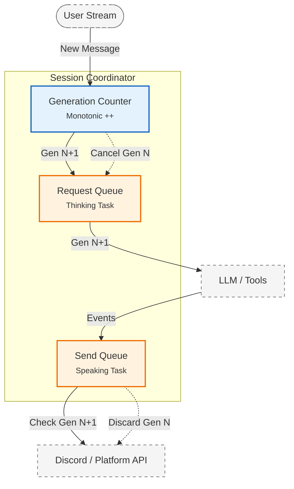
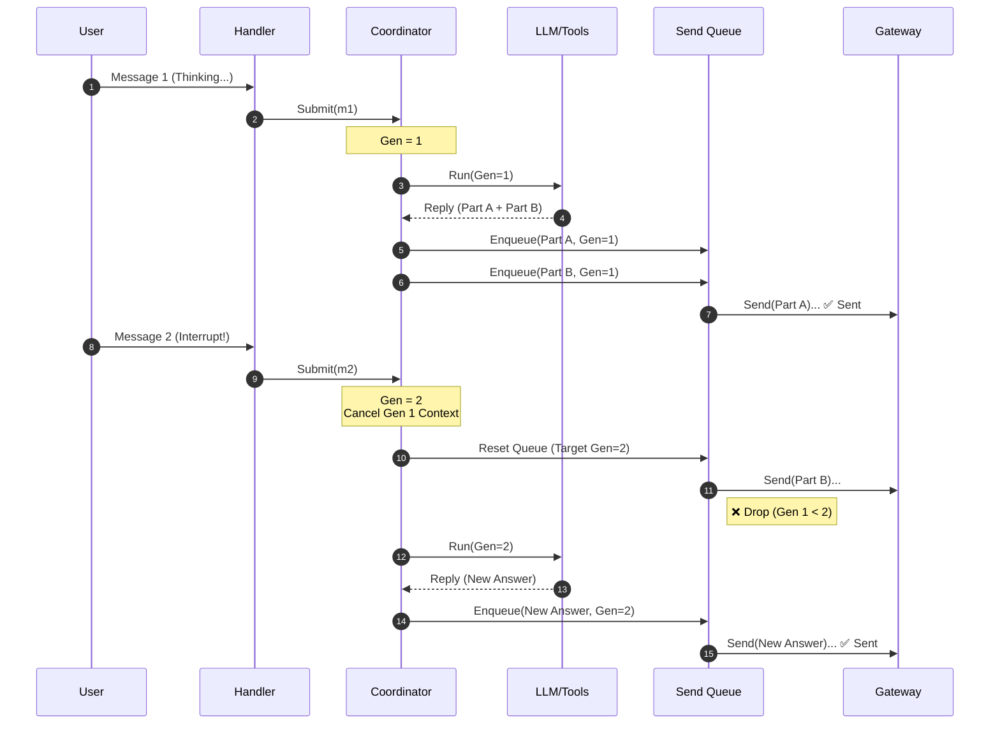

import Tabs from '@theme/Tabs';
import TabItem from '@theme/TabItem';

`assistant-agent` (项目代号 `Subaru`) 最初采用了简单的“一问多答”模型。这在单轮对话中表现良好，但在用户连续输入时，旧的请求会阻塞新的意图，导致回复滞后且上下文错位。

目前 Subaru 通过双层队列，实现了类似真人的多消息交互体验。

<!-- truncate -->

:::info 核心愿景
当用户连续说话时，Subaru 不应像一台卡顿的打印机那样按顺序吐纸。她应该具备抢占式的能力：当捕捉到用户的新消息时，立即停止当前未完成的思考或发言，以最新的输入为准重新组织对话。
:::

## 两类“未完成”

要实现流畅的打断体验，我们必须在两个不同的维度上通过“撤回”来释放资源：

1.  **Thinking (请求处理中)**：LLM 正在生成回复，或正在执行工具调用。
2.  **Speaking (消息发送中)**：回复已生成并被解析为多个片段（文本、语音、贴纸），正排队等待通过 API 发出（因为我们实现的打字延迟，消息不会一次全部发出）。

如果只取消 LLM 请求，已生成的缓冲消息仍会继续发出；如果只清空发送队列，后台的 LLM 仍会继续消耗算力并可能产生新的幻觉。

## 架构设计

为了解决这个问题，我们将对话流水线拆解，并引入了 **Generation ID (世代计数器)** 来管理生命周期。

<Tabs>
  <TabItem value="mechanism" label="分代抢占机制" default>
    我们引入了一个单调递增的 `generation` 计数器：

    1. **版本迭代**：每次收到用户的新消息，`generation++`。
    2. **请求标记**：所有的 Request 和 Send Event 都携带当前的 `generation`。
    3. **惰性丢弃**：
       - **Request Queue**：新消息到来时，立即取消正在执行的请求，并丢弃旧请求。
       - **Send Queue**：在实际调用 API 发送前，校验 `Event.generation == Current.generation`。若不匹配，直接丢弃。

    Send Queue 中是“已解析但未发送”的事件流，包括工具调用的前置提示 `Tool Prelude`、分段的长文本、Sticker、生成的语音

    为了让“打断”彻底生效，所有的输出行为都必须收敛到这个队列中。只有这样，当用户打断时，我们才能在最后拦截住那些已经生成但还没发出去的废话。
  </TabItem>
  <TabItem value="isolation" label="隔离粒度">
    为了防止“群聊中 A 说话打断了 B 的回复”，我们采用了细粒度的隔离策略。
    
    **Isolation Key**: `(channelID, userID)`

    - **同频道不同用户**：队列独立，互不干扰。
    - **同用户不同频道**：队列独立，互不影响。
    
    :::tip 为什么不用 Session ID？
    Session ID 往往在对话开始后才生成，而队列管理需要在消息到达网关的那一刻立即介入。
    :::
  </TabItem>
</Tabs>

---

## 生命周期时序

下面的时序图展示了当用户快速发送两条消息时，系统如何丢弃旧任务。

---

## 工程实现与边界

为了保证系统的高响应性与数据一致性，工程实现上关注以下细节：

### 关键路径

1.  **可中断的发送循环**
    发送逻辑不再是简单的 `for range`，而是必须在每一步检查 `ctx.Done()` 和 `generation` 版本。

2.  **状态写入的原子性**
    虽然对话可以被抢占，但 **记忆（L3/L4）** 的写入必须串行化。如果旧请求在被取消前已经产生了新的长期记忆（如更新了用户画像），该操作应当原子化完成，避免数据竞态。

### 局限性

*   **无法撤回已发送消息**：抢占机制只能阻止“未发生”的动作。Subaru 无法撤回已经推送到客户端的消息。
*   **工具副作用**：如果旧请求触发了具有外部副作用的工具（如 `SendEmail`），且工具已经开始执行，则通常难以从外部中断。
