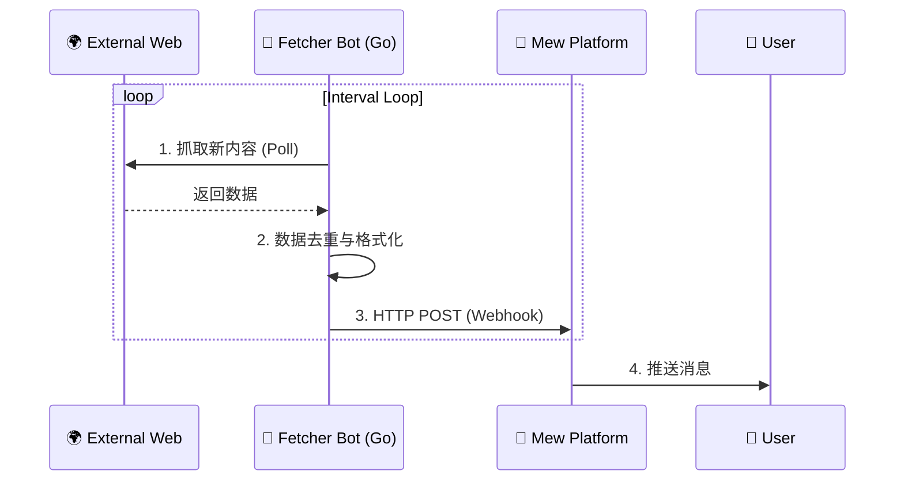
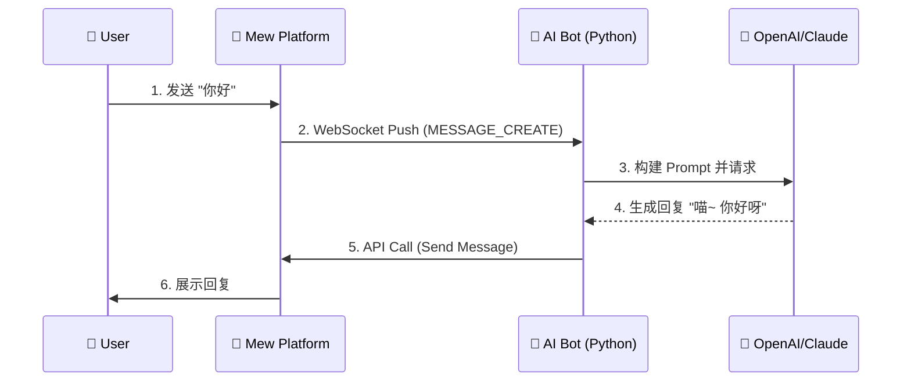

# 🤖 Bot 生态系统

> **🚧 施工中 (Work in Progress)**
>
> 本章节描述的 API 和 SDK 正在快速迭代中。

欢迎来到 Mew 的“业务大脑”。

Mew 采用了**微服务架构**的极致形式：平台本身（The Bus）只负责消息的搬运，而所有真正有趣的业务逻辑——无论是抓取推特新闻，还是与 AI 谈天说地——都由独立运行的 **Bot 服务** 承担。

这种设计赋予了 Mew 无限的可能性：**想要新功能？写个 Bot 就行，无需触碰核心代码。**

---

## 3.1 核心范式

Mew 的 Bot 生态被划分为两个平行的世界，分别对应两种截然不同的数据流向。

### 📡 1. 广播模式：消息推送 Bot
> **关键词**: 单向、无状态、高并发、Go

这类 Bot 是不知疲倦的**信息搬运工**。它们运行在后台，定期从外部世界抓取数据，并通过 Webhook 单向投递到 Mew。

*   **典型场景**: RSS 阅读器、Twitter/X 监控、股票预警、Bilibili 更新提醒。
*   **通信流向**: `External World` -> `Fetcher Bot` -> `Webhook` -> `Mew Channel`



### 💬 2. 会话模式：交互式 Bot
> **关键词**: 双向、有状态、事件驱动、Python

这类 Bot 是聪明的**对话伙伴**。它们通过 WebSocket 接入平台，能够“听懂”用户的话，并经过思考（LLM 推理）后做出回应。

*   **典型场景**: AI 女友/男友、RPG 游戏主持人、智能客服、运维助手。
*   **通信流向**: `User` \<-> `Mew Platform` \<-> `WebSocket` \<-> `Interactive Bot` \<-> `LLM`



---

## 3.2 配置驱动架构

Mew 的一大创新在于**“配置中心化”**。

Bot 的代码逻辑（Code）与业务配置（Config）是完全分离的。Bot 服务启动时，会从 Mew 平台拉取它的“任务清单”。这意味着：**你可以在 Mew 的网页 UI 上直接修改 Bot 的行为，而无需重启 Bot 后端服务。**

### 3.2.1 数据模型

每个 Bot 在数据库中存储为一个对象，其中最核心的是 `serviceType` 和 `config` 字段。

```typescript
// Collection: bots
interface Bot {
  _id: ObjectId;
  name: string;        // 🤖 显示名称
  avatar: string;      // 🖼️ 头像 URL
  accessToken: string; // 🔑 身份令牌 (用于 Bot API/WebSocket 鉴权)
  
  // 核心字段
  serviceType: string; // 🏷️ 托管服务类型 (e.g., 'rss-fetcher', 'openai-chat')
  config: any;         // ⚙️ 动态配置对象 (Schema 由 type 决定)
  
  dm_enabled: boolean; // 是否允许私聊
  ownerId: ObjectId;   // 创建者 ID
}
```

### 3.2.2 Webhook 的解耦设计

对于 Fetcher Bot，我们设计了一套**“匿名投递”**机制。

1.  **生成**: 用户在任意频道设置中点击“生成 Webhook”。
2.  **绑定**: 用户将 Webhook URL 填入 Bot 的 `config` 中。
3.  **运行**: Bot 只管向这个 URL 发送数据，它**不需要知道**这个 URL 背后是哪个服务器的哪个频道，也不需要处理复杂的频道权限。

---

## 3.3 实现：Fetcher Bots (Golang)

> **为什么选择 Go?**
> 信息抓取通常涉及大量的网络 I/O 和定时任务。Go 语言的 `Goroutine` 机制能让我们以极低的资源消耗同时监控成百上千个数据源。

Fetcher 服务是一个纯后台守护进程。

### 配置示例
在 Mew UI 中，你可以为 `serviceType: 'rss-fetcher'` 等 Bot 填入如下 JSON：

#### 📰 RSS 订阅 (`serviceType: 'rss-fetcher'`)
```json
[
  {
    "rss_url": "https://hn.algolia.com/rss",
    "interval_seconds": 3600,
    "webhook": "http://mew-backend/api/webhooks/<webhookId>/<token>",
    "enabled": true,
    "send_history_on_start": false,
    "max_items_per_poll": 5
  }
]
```

说明：

- `rss_url`：RSS/Atom 地址（兼容 `url` 别名）
- `interval_seconds`（或 `interval`）：轮询间隔（秒）
- `webhook`：频道 Webhook 投递地址（后端路由：`POST /api/webhooks/:webhookId/:token`）
- 推送消息类型默认为 `app/x-rss-card`（前端会渲染为 RSS 卡片）

#### 🐦 Twitter/X 监控 (`type: 'x'`)
支持数组结构，一个 Bot 实例监控多个账号。
```json
[
  {
    "username": "elonmusk",
    "interval": 600,
    "webhook": "http://mew-backend/api/webhooks/<webhookId>/<token>"
  },
  {
    "username": "nasa",
    "interval": 1800,
    "webhook": "http://mew-backend/api/webhooks/<webhookId>/<token>"
  }
]
```

---

## 3.4 实现：Interactive Bots (Python)

> **为什么选择 Python?**
> Python 是 AI 领域的通用语。拥有 `LangChain`, `OpenAI SDK`, `PyTorch` 等无与伦比的生态支持。

Interactive 服务是一个长连接客户端。它通过 WebSocket 保持在线，随时准备响应用户的 `@提及` 或私聊。

### 配置示例
在 Mew UI 中，你可以为 AI Bot 定义它的人格和大脑。

#### 🧠 基础对话模型 (`type: 'simple_chat'`)
```json
{
  // 模型提供商配置
  "llm_provider": "openai",
  "model": "gpt-4o",
  "api_key": "sk-proj-...", // ⚠️ 注意：生产环境建议使用环境变量注入，而非明文存储
  
  // 模型参数
  "temperature": 0.7,
  "max_tokens": 500,
  
  // 🎭 人格设定 (System Prompt)
  "system_prompt": "你是一只名叫 Mew酱 的猫娘，性格傲娇但内心善良。请用可爱的口吻回答问题，并在句末加上'喵~'。"
}
```

### 开发流程
1.  **监听**: 接收 `MESSAGE_CREATE` 事件。
2.  **过滤**: 忽略自己发送的消息，忽略无关频道的消息。
3.  **思考**: 将历史聊天记录和当前消息打包发给 LLM。
4.  **回复**: 调用 `POST /api/channels/{id}/messages` 接口发送回复。
