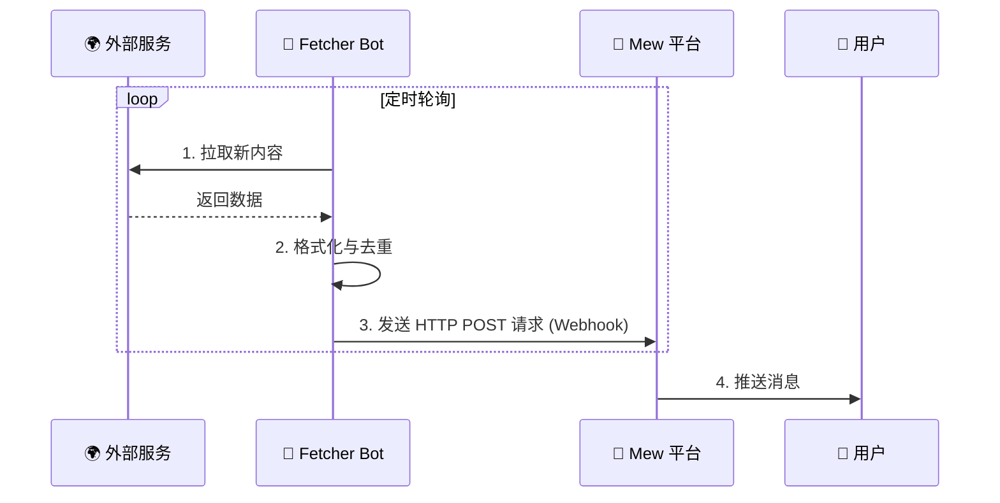
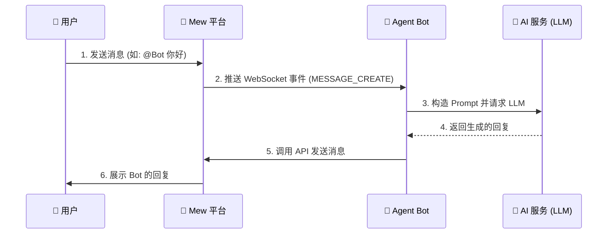

# 🤖 机器人开发

Mew 的核心设计理念之一是微服务化。平台本身仅负责核心的消息路由，而所有业务逻辑——无论是抓取外部内容，还是与 AI 进行交互——均通过独立的 **Bot** 服务实现。

这种设计赋予了 Mew 极高的可扩展性。

> **想要新功能？编写一个 Bot 即可，无需改动核心代码。**

---

## Bot 的两种工作模式

根据数据流向和交互方式的不同，Mew 的机器人主要分为两种类型。

### 1. 消息推送 Bot (Fetcher)

> **关键词**: 单向推送、无状态、高并发、Webhook

这类 Bot 主要负责从外部数据源（如 RSS、Twitter）获取信息，并**单向推送**到 Mew 的指定频道。它们是信息聚合与分发的管道。

*   **典型场景**: RSS 阅读器、社交媒体监控、服务状态预警、更新提醒。
*   **通信流向**: `外部服务` -> `Fetcher Bot` -> `Webhook` -> `Mew 频道`



### 2. 会话机器人 (Agent)

> **关键词**: 双向交互、有状态、事件驱动、WebSocket

这类 Bot 负责与用户进行**双向交互**。它们通过 WebSocket 长连接接入平台，能够接收并响应用户的消息，通常用于实现需要上下文理解的复杂任务。

*   **典型场景**: AI 聊天伴侣、RPG 游戏主持人 (GM)、智能客服、运维助手。
*   **通信流向**: `用户` \<-> `Mew 平台` \<-> `WebSocket` \<-> `Agent Bot` \<-> `LLM`



---

## 配置驱动的设计

Mew 的 Bot 设计核心在于**配置与代码分离**。Bot 的运行时行为由其在 Mew 平台上的配置（Config）决定，而非硬编码在代码中。

这意味着，你可以在 Mew 的管理界面直接修改 Bot 的配置来调整其行为（例如更换 RSS 源地址），**而无需重启后端的 Bot 服务**。

:::info 工作原理
Bot 服务会定期从 Mew 平台拉取其最新的配置列表。SDK 内的 `BotManager` 会比较配置的哈希值，如果检测到变更，它会自动对该 Bot 的运行实例（Runner）执行“热重载”（优雅退出旧实例并启动新实例），从而应用新配置。
:::

### 数据模型

每个 Bot 对应数据库中的一个文档。其核心字段为 `serviceType` (决定了由哪个后端服务处理) 和 `config` (具体的业务配置)。

```typescript title="数据表 collection: bots"
interface Bot {
  _id: ObjectId;
  ownerId: ObjectId;      // 创建者 User ID
  botUserId?: ObjectId;   // 关联的 Bot User (isBot: true)
  name: string;           // 显示名称
  avatarUrl?: string;     // 头像 URL
  serviceType: string;    // 服务类型, 如 'rss-fetcher', 'claude-agent'
  dmEnabled: boolean;     // 是否允许用户私聊
  config: string;         // 业务配置 (JSON 字符串)
  accessToken?: string;   // 用于 Bot 认证，获取 JWT
}
```

### Webhook 的匿名投递机制

对于 Fetcher 类型的 Bot，平台提供了一套解耦的 Webhook 机制：

1.  **生成**：用户在任意频道的设置中，可以生成一个唯一的 Webhook URL。
2.  **配置**：用户将此 URL 填入对应 Bot 的 `config` 中。
3.  **投递**：Bot 服务仅需向此 URL 发送 POST 请求即可推送消息。它无需关心频道权限、服务器地址等细节，实现了彻底的解耦。

---

## 实践：开发消息推送 Bot (Fetcher)

> **参考实现**：`plugins/fetchers/test-fetcher`

Fetcher Bot 是一个后台守护进程，根据 `config` 中的任务列表执行数据拉取和推送。

### 配置示例

以下是 `serviceType: 'rss-fetcher'` 的 Bot 配置示例，该配置为一个 `JSON` 数组，每个对象代表一个订阅任务。

```json title="config 字段内容 (serviceType: 'rss-fetcher')"
[
  {
    "rss_url": "https://hn.algolia.com/rss",
    "interval": 3600,
    "webhook": "http://<mew-host>/api/webhooks/<webhookId>/<token>",
    "enabled": true,
    "send_history_on_start": false
  }
]
```

| 字段名 | 描述 |
| :--- | :--- |
| `rss_url` | 订阅的 RSS/Atom 源地址。 |
| `interval` | 轮询间隔时间，单位为秒。 |
| `webhook` | 频道生成的 Webhook 投递地址。 |
| `enabled` | `true` / `false`，是否启用此任务。 |
| `send_history_on_start` | `true` / `false`，启动时是否推送历史消息。 |


:::caution 网络可达性问题
请确保 `webhook` 的主机地址对于 **Bot 的运行环境** 是可访问的。
- **Docker Compose 内部**: Bot 容器通常可以通过服务名访问主服务，如 `http://server:3000/api/webhooks/...`。
- **外部服务器**: Bot 若部署在其他机器上，必须使用公网可访问的域名或 IP，如 `https://mew.example.com/api/webhooks/...`。
:::

---

## 实践：开发会话机器人 (Agent)

> **参考实现**：`plugins/agents/test-agent`

Agent Bot 是一个长连接客户端，通过 WebSocket 实时监听和响应用户消息。

### 配置示例
`config` 的结构完全由你的 Agent 插件定义。对于简单的 Agent，`config` 甚至可以为空 `JSON` 对象 `{}`。

### 开发流程
标准的 Agent Bot 开发遵循以下步骤：
1.  **连接**：使用 Bot 的 `accessToken` 认证并建立 WebSocket 连接。
2.  **监听**：订阅 `MESSAGE_CREATE` 网关事件。
3.  **过滤**：判断消息是否满足触发条件（例如，是否为 `@自己` 的消息、是否来自特定频道、是否为私聊）。同时，必须忽略由 Bot 自己发送的消息，避免无限循环。
4.  **处理**：执行核心业务逻辑（如调用 LLM API、查询数据库、执行指令等）。
5.  **回复**：通过 WebSocket 或 REST API 将处理结果作为新消息发送回频道。

---

## 深入理解：配置同步机制

当前版本的配置同步是通过 **定时轮询** 实现的，具体流程如下：

*   Bot Service 启动后，会定期调用内部接口 `POST /api/bots/bootstrap`（需携带管理员密钥 `X-Mew-Admin-Secret`），拉取所有与其 `serviceType` 匹配的 Bot 实例及其配置。
*   `plugins/sdk` 中的 `BotManager` 模块会负责管理所有 Bot 实例的生命周期。
*   当检测到某个 Bot 的 `config` 发生变化、或者有新增/删除的 Bot 时，`BotManager` 会自动触发对应 Runner 的热重载。

:::info
`/infra` Socket.IO 命名空间当前主要用于 Bot 的在线状态统计与同步，并不负责推送“配置更新”事件。
:::