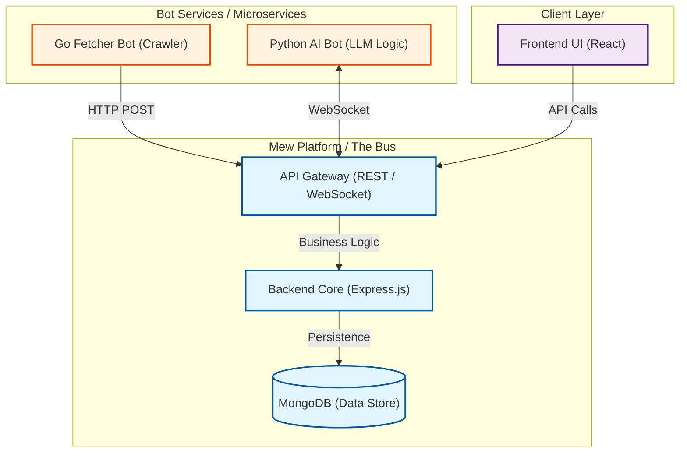

# 项目概览

欢迎来到 **Mew** 的开发者文档。

Mew 是一个**高度私有化、可扩展的数字中枢**。它旨在将碎片化的信息流（Information Flow）与个人情感交互统一到一个以即时通讯（IM）为界面的平台中。

你可以将其视为一个 **Open Source, Self-hosted Mini Discord** —— 完全由你掌控，专为你服务。

## 🎯 核心理念

Mew 的诞生旨在解决现代数字生活的两大痛点：**信息过载**与**数据碎片化**。它不是一个单纯的聊天软件，而是一个连接“外部世界”与“内心世界”的桥梁。

### 名字的由来

*   🧬 **基因 (The Gene)**: 致敬传说中的宝可梦 **Mew (梦幻)**。它拥有所有宝可梦的基因，象征着本项目作为“基座”的无限可扩展性。
*   🐱 **声音 (The Sound)**: 谐音猫叫声 **Meow**，为理性的代码世界增添一丝慵懒、治愈的亲切感。
*   💡 **灵感 (The Inspiration)**: 源自希腊神话中的 **Muse (缪斯)**，寓意这里将成为你创意与灵感的源泉。
*   📦 **功能 (The Function)**: **M**essage **W**arehouse 的缩写，直观阐述了其作为“消息聚合与存储中心”的核心定位。

### 主要特性

| 功能模块 | 描述 |
| :--- | :--- |
| **📢 信息聚合器** | 你的全自动信息管家。Mew 自动从 X (Twitter)、Bilibili、RSS 等源头抓取动态，并推送到专属频道。告别应用切换，享受纯净的时间线。 |
| **🤖 AI 伴侣** | 深度集成的 LLM 伙伴。它不仅是一个问答机器人，更是具备长短期记忆的情感支持者，随时准备与你进行深度对话。 |

---

## 🏗 系统架构

Mew 采用了**“总线-服务”**的解耦架构设计。这种设计模式将“通信基础设施”与“业务逻辑”完全分离，确保了系统的稳定性与极高的可扩展性。

### 架构图

### 组件职责

#### 1. Mew 平台 🚌
> **系统的“神经中枢”**

*   **职责**：仅负责核心的通用功能——消息传输、持久化存储、用户鉴权与 UI 渲染。它不关心消息的内容（是推特新闻还是 AI 聊天），只负责将消息安全送达。
*   **优势**：**核心纯粹性**。复杂的业务逻辑变更永远不会破坏核心平台的稳定性。

#### 2. Bot 服务 🧠
> **系统的“大脑”与“手脚”**

*   **职责**：所有具体业务逻辑的实现者。它们作为独立运行的微服务（Microservices）存在。
    *   **Fetcher Bot (Go)**: 负责高并发的数据抓取。
    *   **AI Bot (Python)**: 处理复杂的自然语言推理。
*   **优势**：**热插拔架构**。想要增加一个“股票监控”功能？只需写一个新的 Bot，无需重启或修改核心平台。

---

## 🛠 技术栈

Mew 选用了现代化的技术栈，兼顾了**开发体验 (DX)** 与**运行时性能**。

### 💻 前端
构建快速、响应式且美观的用户界面。

*   **Core**: `React`, `TypeScript`
*   **State**: `Zustand`, `TanStack Query` (Server State)
*   **UI/UX**: `Tailwind CSS`, `Iconify`, `TipTap` (Rich Text)

### 🔌 后端平台
稳定高效的消息总线。

*   **Runtime**: `Node.js`, `Express`
*   **Communication**: `Socket.io` (Real-time), `REST API`
*   **Data**: `MongoDB` (NoSQL), `Garage` (S3 Object Storage)
*   **Validation**: `Zod`

### 🤖 Bot 微服务
根据任务特性选择最适合的语言。

*   **Crawler / I/O Heavy**: `Golang` (High Concurrency)
*   **AI / Logic Heavy**: `Python` (Rich AI Ecosystem)

### 🚀 运维与部署
开箱即用的部署体验。

*   **Container**: `Docker`, `Docker Compose`
*   **CI/CD**: `GitHub Actions`
