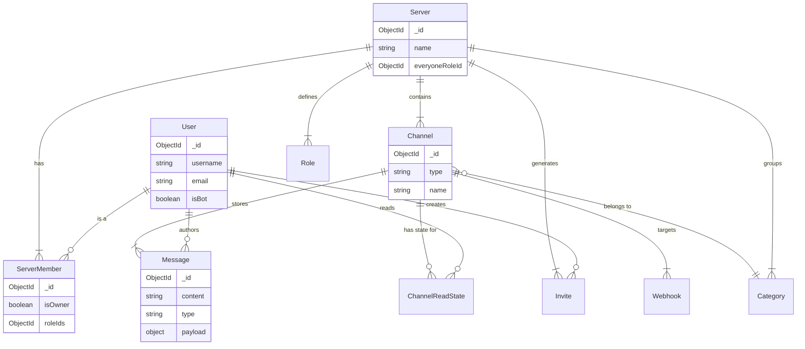

# 🏛️ 核心平台设计

Mew 平台是整个生态系统的基石。它不直接参与具体的业务逻辑（如爬取推特或生成式 AI 回复），而是专注于提供一个**实时、持久化、高并发**的消息总线。

本章将深入剖析支撑 Mew 运行的三大支柱：**数据模型**、**消息协议**与**通信接口**。

---

## 2.1 数据库架构

Mew 使用 **MongoDB** 作为主存储。数据模型采用“引用”的设计模式，实体之间通过 `ObjectId` 进行关联，以确保数据的一致性和查询的灵活性。

### 实体关系图



### 集合定义

以下定义使用 TypeScript 接口描述数据的存储形态（Schema）。所有包含 `timestamps: true` 的集合均自动包含 `createdAt` 和 `updatedAt` 字段。

#### 👤 用户与鉴权
**`users`**
系统中的全局身份实体，包含人类用户和 Bot 用户。
```typescript
// Collection: users
{
  _id: ObjectId,
  email: String,      // 邮箱，唯一
  username: String,   // 用户名，唯一
  password: String,   // 哈希后的密码 (默认不返回)
  avatarUrl: String,  // 头像 URL (可选)
  isBot: Boolean,     // 是否为机器人账户
  createdAt: Date,
  updatedAt: Date
}
```

#### 🏰 服务器与组织
**`servers`**
最高层级的数据容器，功能上类似于 Discord 的 Guild。
```typescript
// Collection: servers
{
  _id: ObjectId,
  name: String,       // 服务器名称
  avatarUrl: String,  // 服务器图标 URL (可选)
  everyoneRoleId: ObjectId, // @everyone 默认角色的ID (ref: roles)
  createdAt: Date,
  updatedAt: Date
}
```

**`roles`**
用于服务器内的权限分组和身份标识。
```typescript
// Collection: roles
{
  _id: ObjectId,
  name: String,               // 角色名称
  serverId: ObjectId,         // 所属服务器ID (ref: servers)
  permissions: [String],      // 权限字符串列表
  color: String,              // 角色颜色
  position: Number,           // 角色位置，用于层级判断
  isDefault: Boolean,         // 是否为 @everyone 角色
  createdAt: Date,
  updatedAt: Date
}
```

**`serverMembers`**
关联表，记录 `User` 与 `Server` 的多对多关系及在特定服务器内的属性。
```typescript
// Collection: serverMembers
{
  _id: ObjectId,
  serverId: ObjectId, // 所属服务器ID (ref: servers)
  userId: ObjectId,   // 用户ID (ref: users)
  roleIds: [ObjectId],// 拥有的角色ID列表 (ref: roles)
  isOwner: Boolean,   // 是否为服务器所有者
  nickname: String,   // 在该服务器的昵称 (可选)
  createdAt: Date,
  updatedAt: Date
}
```

**`invites`**
服务器邀请链接实体。
```typescript
// Collection: invites
{
  _id: ObjectId,
  code: String,         // 邀请码，唯一
  serverId: ObjectId,   // 目标服务器ID (ref: servers)
  creatorId: ObjectId,  // 创建者ID (ref: users)
  expiresAt: Date,      // 过期时间 (可选)
  maxUses: Number,      // 最大使用次数 (0为无限)
  uses: Number,         // 当前使用次数
  createdAt: Date,
  updatedAt: Date
}
```

#### 💬 频道与消息
**`categories`**
用于组织服务器内的频道。
```typescript
// Collection: categories
{
  _id: ObjectId,
  name: String,         // 分类名称
  serverId: ObjectId,   // 所属服务器ID (ref: servers)
  position: Number,     // 分类位置 (可选)
  createdAt: Date,
  updatedAt: Date
}
```

**`channels`**
通信的基本单元，分为服务器频道和私聊频道。
```typescript
// Collection: channels
{
  _id: ObjectId,
  name: String,               // 频道名称 (服务器频道)
  type: String,               // 类型: 'GUILD_TEXT' 或 'DM'
  serverId: ObjectId,         // 所属服务器ID (ref: servers, 仅 GUILD_TEXT)
  categoryId: ObjectId,       // 所属分类ID (ref: categories, 仅 GUILD_TEXT)
  recipients: [ObjectId],     // 参与者ID列表 (ref: users, 仅 DM)
  position: Number,           // 频道位置 (可选)
  permissionOverrides: [      // 频道级权限覆盖
    {
      targetType: String,     // 'role' 或 'member'
      targetId: ObjectId,
      allow: [String],
      deny: [String]
    }
  ],
  createdAt: Date,
  updatedAt: Date
}
```

**`messages`**
核心资产。此集合数据量最大，设计上针对查询进行了深度优化。
```typescript
// Collection: messages
{
  _id: ObjectId,
  channelId: ObjectId,        // 所属频道ID (ref: channels)
  authorId: ObjectId,         // 发送者ID (ref: users)
  type: String,               // 消息类型，默认为 'message/default'
  content: String,            // 纯文本内容，作为降级方案
  payload: Object,            // 结构化数据，用于前端自定义渲染
  attachments: [              // 附件列表
    {
      filename: String,
      contentType: String,
      key: String,            // S3/Garage 中的对象键
      size: Number
    }
  ],
  mentions: [ObjectId],       // @ 的用户ID列表
  referencedMessageId: ObjectId, // 回复的消息ID (ref: messages)
  reactions: [                // 表情回应
    {
      emoji: String,
      userIds: [ObjectId]
    }
  ],
  editedAt: Date,             // 消息编辑时间
  retractedAt: Date,          // 消息撤回时间
  createdAt: Date,
  updatedAt: Date
}
```
> **性能提示**: `channelId` 和 `createdAt` 字段已建立索引以优化历史消息查询。`content` 字段已建立文本索引以支持搜索。

**`channelReadStates`**
记录用户在频道中已读消息的状态，用于实现未读消息提示。
```typescript
// Collection: channelReadStates
{
  _id: ObjectId,
  userId: ObjectId,           // 用户ID (ref: users)
  channelId: ObjectId,        // 频道ID (ref: channels)
  lastReadMessageId: ObjectId,// 最后已读的消息ID (ref: messages)
  createdAt: Date,
  updatedAt: Date
}
```

**`webhooks`**
用于外部服务向频道内发送消息。
```typescript
// Collection: webhooks
{
  _id: ObjectId,
  name: String,
  avatarUrl: String,
  channelId: ObjectId, // 目标频道 (ref: channels)
  serverId: ObjectId,  // 所属服务器 (ref: servers)
  token: String,       // 用于认证的随机令牌
  botUserId: ObjectId, // 关联的机器人用户ID (ref: users)
  createdAt: Date,
  updatedAt: Date
}
```

---

## 2.2 消息协议

Mew 的核心在于其**“多态消息协议”**。我们不限制消息必须是文本，它也可以是 RSS 卡片、代码片段甚至是一个交互式的小程序。

### 协议结构
每一条消息都是一个携带了“渲染指令”的数据包。

| 字段 | 类型 | 必填 | 描述 |
| :--- | :--- | :--- | :--- |
| **`type`** | `string` | ✅ | **MIME-like 类型标识**。告诉前端：“请用这个组件来渲染我”。例如: `message/default`, `app/x-rss-card`, `app/x-github-pr` |
| **`content`** | `string` | ✅ | **优雅降级**。消息的纯文本表示。如果客户端不支持上述 `type` 的渲染器，或者用户正在使用纯文本终端，将显示此字段。 |
| **`payload`** | `object` | ❌ | **渲染数据**。包含前端组件渲染所需的所有结构化数据。例如，对于 Webhook 消息，`payload.overrides` 可用于覆盖机器人用户的名称和头像。 |
| **`attachments`** | `array` | ❌ | **附件列表**。每个附件对象在数据库中存储 `key` (对象存储键)，`url` 字段由后端在返回给客户端时动态生成。 |

### 🌟 示例：一条 RSS 卡片消息

```json
{
  "_id": "ObjectId(...)",
  "channelId": "ObjectId(...)",
  "authorId": {
    "_id": "ObjectId(...)",
    "username": "RSS Bot",
    "avatarUrl": "url_to_bot_avatar.png"
  },
  "type": "app/x-rss-card",
  "content": "[文章] OpenAI 发布新模型...",
  "payload": {
    "title": "OpenAI 发布新模型",
    "summary": "这是一个重要的里程碑，它将改变...",
    "url": "https://example.com/news/123",
    "thumbnail_url": "https://.../image.png"
  },
  "createdAt": "2023-10-27T10:00:00Z"
}
```

**前端渲染伪代码**:
```javascript
const MessageRenderer = ({ msg }) => {
  // 1. 尝试查找对应类型的渲染组件
  const CustomComponent = componentRegistry.get(msg.type);
  
  // 2. 如果存在，将 payload 传递给它
  if (CustomComponent) {
    return <CustomComponent data={msg.payload} />;
  }
  
  // 3. 否则，回退到默认文本和附件渲染
  return (
    <>
      <TextBubble>{msg.content}</TextBubble>
      <AttachmentList attachments={msg.attachments} />
    </>
  );
};
```

---

## 2.3 通信接口

Mew 采用 **Hybrid 通信模式**：WebSocket 负责低延迟的实时事件推送，REST API 负责标准的资源 CRUD 操作。

### 🔌 WebSocket (Socket.io)
*   **Endpoint**: `/`
*   **Auth**: Handshake `auth: { token: "JWT_HERE" }`

#### 服务端广播事件 (Server -> Client)
房间（Room）的 ID 通常是 `serverId`、`channelId` 或 `userId`。

| 事件名 | 房间 | 描述 |
| :--- | :--- | :--- |
| `MESSAGE_CREATE` | `channelId` | 创建了一条新消息。 |
| `MESSAGE_UPDATE` | `channelId` | 消息被编辑或撤回。 |
| `MESSAGE_REACTION_ADD` | `channelId` | 消息增加了表情回应。 |
| `MESSAGE_REACTION_REMOVE` | `channelId` | 消息移除了表情回应。 |
| `PRESENCE_UPDATE` | *Global* | 用户上线或下线。 |
| `PRESENCE_INITIAL_STATE` | `socketId` | 连接成功后，向客户端发送当前所有在线用户列表。 |
| `CHANNEL_UPDATE` | `serverId` | 服务器内频道信息变更。 |
| `CHANNEL_DELETE` | `serverId` | 服务器内频道被删除。 |
| `CATEGORY_UPDATE` | `serverId` | 频道分类信息变更。 |
| `CATEGORY_DELETE` | `serverId` | 频道分类被删除。 |
| `PERMISSIONS_UPDATE` | `serverId`, `userId` | 权限变更，通常由角色或覆盖更新触发，通知客户端刷新权限。 |
| `SERVER_UPDATE` | `serverId` | 服务器信息变更。 |
| `SERVER_DELETE` | `serverId` | 服务器被删除。 |
| `SERVER_KICK` | `userId` | 用户被踢出服务器。 |
| `MEMBER_LEAVE` | `serverId` | 成员离开服务器。 |
| `DM_CHANNEL_CREATE` | `userId` | 用户收到了一个新的私聊频道创建事件。 |

#### 客户端发送事件 (Client -> Server)

| 事件名 | 描述 |
| :--- | :--- |
| `message/create` | 客户端通过 WebSocket 发送消息，作为 REST API 的替代方案。 |

### 🌐 REST API
所有 API 均位于 `/api` 命名空间下。所有需要身份验证的路由均需提供 `Authorization: Bearer <JWT>` 请求头。

#### 资源层级概览
```text
/api
├── /auth
│   ├── /login
│   └── /register
├── /users
│   ├── /@me                          # 获取当前用户信息
│   │   ├── /servers                  # 获取当前用户加入的服务器列表
│   │   └── /channels                 # 获取/创建当前用户的私聊(DM)频道
│   ├── /search                       # 搜索用户
│   └── /:userId                      # 获取指定用户信息
├── /servers
│   ├── /:serverId
│   │   ├── /channels                 # (频道管理)
│   │   │   ├── /:channelId
│   │   │   │   ├── /messages         # (消息管理)
│   │   │   │   ├── /webhooks         # (Webhook管理)
│   │   │   │   └── /permissions      # (频道权限覆盖)
│   │   ├── /roles                    # (角色管理)
│   │   ├── /members                  # (成员管理)
│   │   ├── /invites                  # (邀请管理)
│   │   └── /search                   # (服务器内消息搜索)
│   └── /:serverId/categories         # (分类管理)
├── /categories
│   └── /:categoryId                  # (单个分类管理)
├── /channels/:channelId              # (私聊频道相关)
│   ├── /messages                     # (私聊消息管理)
│   ├── /ack                          # (标记频道为已读)
│   └── /uploads                      # (文件上传)
├── /invites/:inviteCode              # (公开) 获取/接受邀请
└── /webhooks/:webhookId/:token     # (公开) 执行Webhook
```