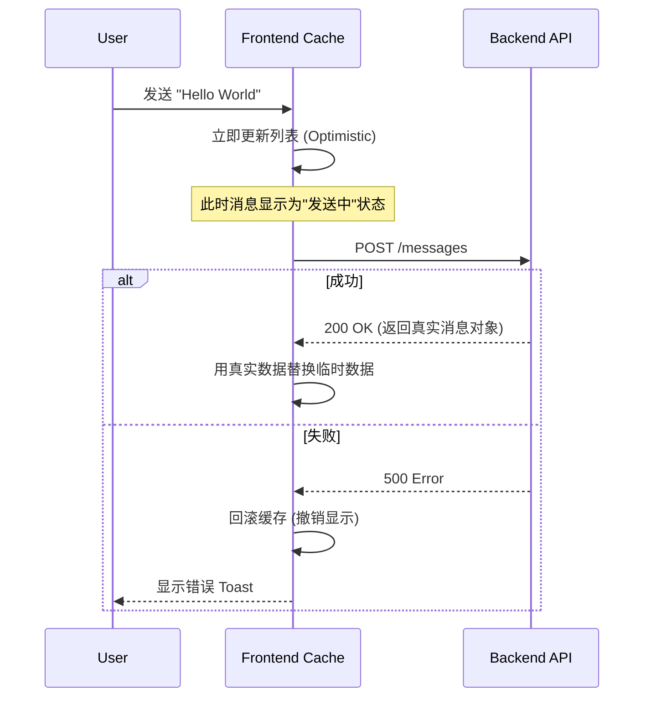

# 🎨 前端开发指南

Mew 的前端不仅仅是一个网页，它是一个**响应迅速、实时交互的现代化 SPA（单页应用）**。

我们采用 **React** 构建界面，利用 **WebSocket** 实现毫秒级通讯，并严格遵循“关注点分离”的架构原则。本章将带你深入了解支撑 Mew 运行的工程骨架与核心模式。

---

## 🏗️ 项目结构

为了应对复杂的业务逻辑，Mew 摒弃了传统的“按文件类型分组”（把所有组件放一起、所有 Hook 放一起），而是采用了更具可扩展性的 **Feature-First (按功能分组)** 架构。

### 目录概览
```text
frontend/src/
├── 🧩 features/            # [核心] 业务功能模块
│   ├── auth/               # 🔐 认证：登录表单、注册逻辑
│   ├── chat/               # 💬 聊天：消息流、输入框、气泡渲染
│   ├── channels/           # 📢 频道：侧边栏列表、创建频道
│   └── servers/            # 🖥️ 服务器：服务器切换、设置
├── 🧱 layout/              # [布局] 应用骨架
│   ├── modals/             # 全局模态框容器
│   └── MainLayout.tsx      # 应用的主界面外壳
├── 🛠️ shared/              # [共享] 通用基础设施
│   ├── api/                # Axios 实例与 Socket 客户端
│   ├── components/         # 原子组件 (Button, Input, Avatar)
│   ├── hooks/              # 通用 Hooks (useDebounce, useTheme)
│   ├── stores/             # Zustand 全局状态定义
│   └── types/              # 全局 TypeScript 接口
├── 🧪 mocks/               # MSW (Mock Service Worker) 测试拦截
├── 🚀 App.tsx              # 路由配置与 Provider 包裹
└── 🏁 main.tsx             # 入口文件
```

> **💡 设计哲学**：在 `features` 目录下，每个文件夹都是一个自包含的单元。例如 `chat` 功能拥有自己私有的组件和 Hooks。只有当逻辑需要在多个功能间复用时，它才会被提取到 `shared` 目录。

---

## 🧠 状态管理

Mew 将状态明确划分为两类，并分别治理：
1.  **客户端状态**：UI 交互状态（如弹窗开关、当前选中的 ID）。由 **Zustand** 管理。
2.  **服务端状态**：来自后端的数据（如消息列表、用户信息）。由 **TanStack Query** 管理。

### 1. 客户端状态 - Zustand
我们选择 [Zustand](https://github.com/pmndrs/zustand) 是因为它极致轻量且无样板代码。所有的 Store 都位于 `src/shared/stores/`。

**核心 Store 清单**：

| Store | 职责描述 | 关键 Action |
| :--- | :--- | :--- |
| `useAuthStore` | **身份凭证**。管理 Token 和当前用户对象，负责持久化。 | `setAuth`, `logout` |
| `useUIStore` | **导航状态**。记录用户当前“在哪里”（哪个服务器、哪个频道）。 | `toggleMemberList` |
| `useModalStore` | **弹窗控制**。全剧唯一的模态框控制器，避免 DOM 层级混乱。 | `openModal`, `closeModal` |
| `useUnreadStore` | **红点管理**。实时计算未读消息数。 | `markAsRead` |

**代码示例**：
```tsx
// src/shared/stores/store.ts
import { create } from 'zustand';

interface UIState {
  currentServerId: string | null;
  setCurrentServer: (id: string | null) => void;
  // ... 其他状态和操作
}

export const useUIStore = create<UIState>((set) => ({
  currentServerId: null,
  setCurrentServer: (id) => set({ currentServerId: id, currentChannelId: null }),
  // ...
}));

// src/features/servers/components/ServerList.tsx
import { useUIStore } from '../../../shared/stores/store';

function ServerList() {
  const { currentServerId, setCurrentServer } = useUIStore();
  // ...
}
```

---

### 2. 服务端状态 - TanStack Query
所有 API 请求均通过 [TanStack Query](https://tanstack.com/query/latest) 封装。它为我们提供了**自动缓存**、**后台静默更新**和**竞态条件处理**能力。

#### 查询键策略
Query Key 是缓存的唯一标识，我们遵循 RESTful 风格的数组结构：
*   `['servers']`: 用户的所有服务器列表。
*   `['channels', serverId]`: 特定服务器的频道列表。
*   `['dmChannels']`: 用户的私信频道列表。
*   `['messages', channelId]`: 特定频道的消息列表。
*   `['members', serverId]`: 特定服务器的成员列表。
*   `['roles', serverId]`: 特定服务器的角色列表。

#### ✨ 乐观更新
为了极致的体验，当用户发送消息时，我们**不等待**后端响应，直接将消息推入 UI。



**实现代码片段**:
1.  **查询数据 (`useQuery`)**:
    ```tsx
    // src/shared/hooks/useMessages.ts
    import { useQuery } from '@tanstack/react-query';
    import { messageApi } from '../services/api';

    export const useMessages = (serverId, channelId) => {
      return useQuery({
        queryKey: ['messages', channelId],
        queryFn: () => messageApi.list(serverId, channelId).then(res => res.data),
        enabled: !!channelId,
      });
    };
    ```

2.  **修改数据 (`useMutation`)** 并实现乐观更新:
    ```tsx
    // src/features/chat/messages/MessageInput.tsx (简化示例)
    import { useQueryClient } from '@tanstack/react-query';
    import { messageApi } from '../../../shared/services/api';

    function MessageInput({ channelId }) {
      const queryClient = useQueryClient();

      const sendMessage = async (content) => {
        // 1. 构造一个临时消息对象
        const tempMessage = { _id: Date.now(), content, ... };

        // 2. 乐观地更新UI
        queryClient.setQueryData(['messages', channelId], (old) => [...old, tempMessage]);

        try {
          // 3. 发送API请求
          await messageApi.send(serverId, channelId, { content });
          // 4. 请求成功后，使缓存失效以获取真实数据
          queryClient.invalidateQueries({ queryKey: ['messages', channelId] });
        } catch (err) {
          // 5. 如果失败，回滚乐观更新
          queryClient.setQueryData(['messages', channelId], (old) => old.filter(m => m._id !== tempMessage._id));
        }
      };
      // ...
    }
    ```

---

## 🧩 插件化消息渲染系统

Mew 的聊天核心采用了**多态渲染**设计。这使得我们支持无限种类的消息类型（Markdown, 图片, RSS 卡片, 投票），而无需修改核心逻辑。

### 核心原理
后端返回的消息包含 `type` 和 `payload` 字段。前端的 `MessageContent` 组件充当**工厂模式**的角色，根据 `type` 分发给特定的渲染器。

```tsx
// src/features/chat/messages/MessageContent.tsx (简化示例)
import React from 'react';
import { RssCard } from './renderers/RssCard'; // 假设的渲染器组件

const MessageContent: React.FC<{ message: Message }> = ({ message }) => {
    const isRssCard = message.type === 'app/x-rss-card';

    if (isRssCard && message.payload) {
        return <RssCard payload={message.payload} />;
    }

    // 默认或降级渲染
    return <p>{message.content}</p>;
};

export default MessageContent;
```

### 🎯 实战：如何添加一个“投票”消息类型？

假设后端新增了一种消息类型：`app/x-poll`。

#### 1. 创建渲染器组件
在 `src/features/chat/renderers/` 下新建 `PollRenderer.tsx`。

```tsx
// src/features/chat/messages/PollMessage.tsx
import type { PollPayload } from '@/shared/types';

interface PollMessageProps {
  payload: PollPayload;
}

export function PollMessage({ payload }: PollMessageProps) {
  return (
    <div>
      <h3>{payload.question}</h3>
      <ul>
        {payload.options.map(option => (
          <li key={option.id}>{option.text}</li>
        ))}
      </ul>
    </div>
  );
}
```

#### 2. 注册渲染逻辑
在 `src/shared/types/index.ts` 中添加新 `payload` 的类型定义到 `MessagePayload` 接口，以获得类型安全。

```typescript
// src/shared/types/index.ts
export interface MessagePayload {
  // ... 已有类型
  question?: string;
  options?: { id: string; text: string }[];
}
```

修改 `src/features/chat/components/MessageContent.tsx`，将新组件加入分发列表。

```tsx
// src/features/chat/messages/MessageContent.tsx
import { RssCard } from './renderers/RssCard';
import { PollMessage } from './PollMessage'; // 1. 导入

const MessageContent: React.FC<{ message: Message }> = ({ message }) => {
    const isRssCard = message.type === 'app/x-rss-card';
    const isPoll = message.type === 'application/x-poll'; // 2. 添加类型检查

    if (isRssCard && message.payload) {
        return <RssCard payload={message.payload} />;
    }

    if (isPoll && message.payload) { // 3. 添加新的渲染分支
        return <PollMessage payload={message.payload} />;
    }

    // ... 默认渲染
};
```

**Done!** 现在，当 WebSocket 推送一条 `type: 'app/x-poll'` 的消息时，界面将自动渲染出投票卡片。