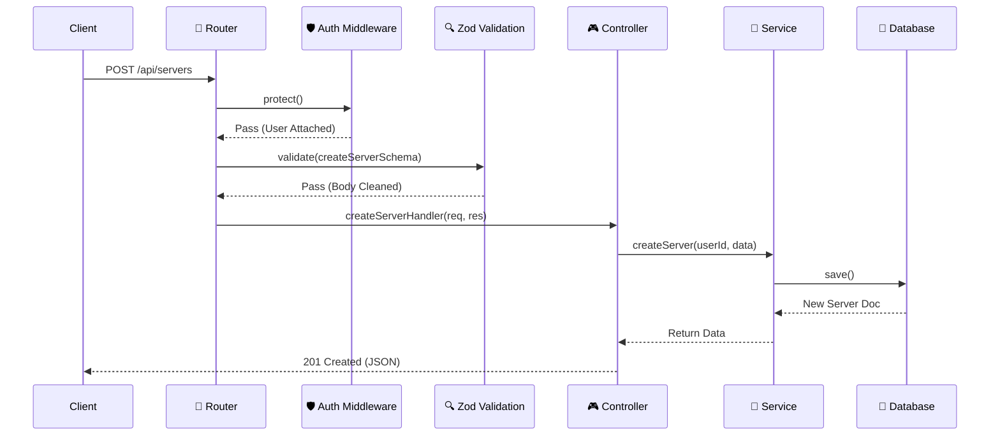

# ⚙️ 后端开发指南

Mew 的后端是系统的**心脏**。它是基于 `Node.js` 和 `Express` 构建的健壮应用，遵循 **MVC (Model-View-Controller)** 架构模式，并在此基础上进行了现代化改造。

它不仅仅是一个 REST API 服务器，还通过 WebSocket 维护着成千上万条实时连接。

---

## 📂 项目结构

我们采用了**以功能为中心 (Feature-First)** 的目录结构。这意味着与同一个功能（如“用户认证”）相关的所有文件（路由、控制器、服务、校验）都住在同一个文件夹里，而不是分散在整个项目中。

这种结构极大地降低了代码跳转的心智负担。

```bash
backend/
├── src/
│   ├── api/                   # API 核心目录
│   │   ├── auth/              # 认证功能模块
│   │   │   ├── auth.controller.ts
│   │   │   ├── auth.routes.ts
│   │   │   ├── auth.service.ts
│   │   │   └── auth.validation.ts
│   │   ├── server/            # 服务器功能模块
│   │   │   ├── server.controller.ts
│   │   │   ├── server.model.ts
│   │   │   ├── server.routes.ts
│   │   │   ├── server.service.ts
│   │   │   └── server.validation.ts
│   │   └── ...                # 其他功能模块 (channel, message, user等)
│   ├── config/                # 环境配置加载
│   ├── gateway/               # WebSocket (Socket.io) 网关
│   │   ├── events.ts
│   │   ├── handlers.ts
│   │   └── middleware.ts
│   ├── middleware/            # Express 中间件
│   │   ├── auth.ts            # JWT 认证
│   │   ├── checkPermission.ts # 权限校验
│   │   └── validate.ts        # Zod 数据校验
│   ├── utils/                 # 通用工具函数
│   │   ├── db.ts
│   │   ├── errorHandler.ts
│   │   └── permission.service.ts
│   ├── app.ts                 # Express 应用入口
│   └── server.ts              # HTTP 和 Socket.io 服务器启动脚本
├── .env.example               # 环境变量示例文件
└── package.json
```

---

## 🔄 请求生命周期

当一个客户端发起请求（例如：创建一个新服务器）时，数据会在后端经历一次**完整的旅程**。

为了让你直观理解，我们绘制了以下时序图：



1.  **🛡️ 守卫**: 首先检查 `Authorization` 头（你是谁？）。
2.  **🔍 质检**: 接着用 Zod 扫描请求体，确保没有脏数据（数据对吗？）。
3.  **🎮 调度**: 控制器接手，但不干脏活，只是把数据解包传给服务层。
4.  **🧠 执行**: 服务层处理核心逻辑，写数据库，并可能触发 WebSocket 广播。

---

## 🔐 认证与授权

在 Mew 中，我们严格区分“你是谁”和“你能做什么”。

### 1. 认证 - 你是谁？
我们使用 **JWT** 作为身份令牌。它是无状态的，这意味着服务器不需要在内存中存储 Session。

*   **流程**:
    *   登录成功 ➔ 服务器签发 JWT ➔ 客户端保存（LocalStorage/Cookie）。
    *   后续请求 ➔ 客户端在 Header 带上 `Authorization: Bearer <token>`。
*   **WebSocket 特殊处理**:
    *   WS 连接握手时，Token 必须包含在 `auth` 握手包中。无效 Token 会导致连接被立即切断。

### 2. 授权 - 你能做什么？
这是 Mew 最复杂的逻辑之一，模仿了 Discord 的权限系统。

*   **权限计算**: 并不是简单的“是/否”。系统会综合计算：
    *   👑 **Server Owner**: 拥有无限权力。
    *   🎭 **Base Roles**: 基础角色权限（如 `@everyone`）。
    *   🔀 **Channel Overrides**: 特定频道的权限覆盖（例如：在公告频道禁止发言）。
*   **实现**: `permission.service.ts` 中的 `calculateEffectivePermissions` 是核心算法。如果你要修改权限逻辑，请务必小心这部分代码。

---

## ✅ 数据校验

我们拒绝“信任”前端传来的任何数据。所有输入必须经过 **Zod** 的严格安检。

**为什么选择 Zod?**
*   **TypeScript 优先**: Zod Schema 可以直接推导出 TS 类型，保证前后端类型一致性。
*   **声明式**: 写起来像文档一样清晰。

**最佳实践示例**:

```typescript
// src/api/server/server.validation.ts
import { z } from 'zod';

export const createServerSchema = z.object({
  body: z.object({
    name: z.string().min(1, 'Server name is required'),
    avatarUrl: z.string().url('Invalid URL').optional(),
  }),
});


// src/api/server/server.routes.ts
import validate from '../../middleware/validate';
import { createServerSchema } from './server.validation';
import { protect } from '../../middleware/auth';
import { createServerHandler } from './server.controller';

router.post(
  '/',
  protect, // 先认证
  validate(createServerSchema), // 再校验
  createServerHandler // 最后执行业务逻辑
);
```

---

## 🧠 服务层

服务层是**业务逻辑的避难所**。

**设计原则**:
*   🚫 **No Express**: 服务层代码里绝不应该出现 `req` 或 `res` 对象。这使得服务层易于单元测试，且可以被其他模块（如 WebSocket 处理器）复用。
*   📢 **Event Broadcasting**: 服务层不仅负责改数据库，还负责“喊话”。

**代码解剖**:

```typescript
// src/api/message/message.service.ts
import Message, { IMessage } from './message.model';
import { socketManager } from '../../gateway/events';

export const createMessage = async (data: Partial<IMessage>): Promise<IMessage> => {
  const message = new Message(data);
  await message.save();

  const populatedMessage = await message.populate('authorId', 'username avatarUrl');

  // 向频道内的所有客户端广播 MESSAGE_CREATE 事件
  socketManager.broadcast(
    'MESSAGE_CREATE',
    populatedMessage.channelId.toString(),
    populatedMessage
  );

  return populatedMessage;
};
```