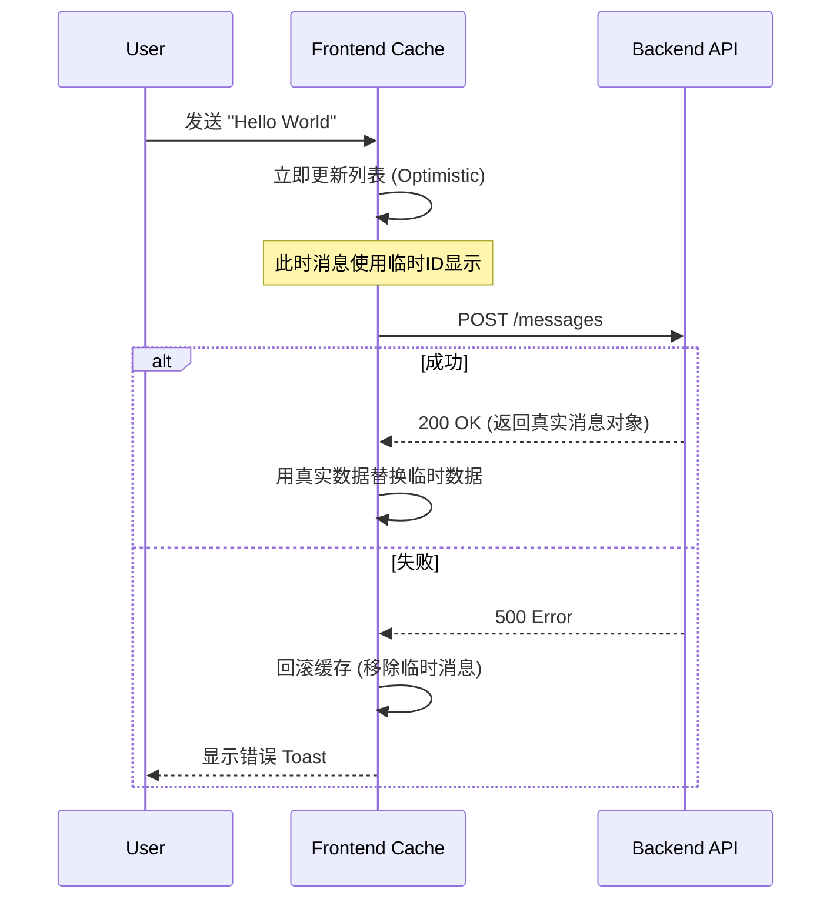

# 🎨 前端开发指南

Mew 的前端是一个响应迅速、实时交互的现代化 SPA（单页应用）。它采用 **React** 构建界面，利用 **WebSocket** 实现实时通讯，并遵循“关注点分离”的架构原则。本章将分析支撑 Mew 前端运行的工程结构与核心模式。

---

## 🏗️ 项目结构

为应对复杂的业务逻辑，Mew 采用 **Feature-First (按功能分组)** 架构。此架构将相关联的业务逻辑（组件、Hooks、模态框）聚合在同一模块下，提高了内聚性。

### 目录概览

```text
frontend/
├── index.tsx               # React 入口（挂载 <App />）
└── src/
    ├── 🧩 features/        # [核心] 业务功能模块
    │   ├── auth/           # 认证：登录表单与鉴权后首屏
    │   ├── servers/        # 服务器：列表、切换、设置、邀请、踢人等模态框
    │   ├── channels/       # 频道：列表、分类、频道设置、权限覆盖、Webhook 管理
    │   ├── chat/           # 聊天区：消息流、输入框、成员列表
    │   ├── messages/       # 消息级功能：目前包含删除消息模态框
    │   ├── search/         # 搜索：消息/用户搜索面板
    │   └── users/          # 用户：个人设置、资料、状态 Footer
    ├── 🧱 layout/          # [布局] 应用骨架
    │   ├── modals/         # ModalManager（全局模态框分发）
    │   └── Layout.tsx      # 主界面外壳（左侧栏 + ChatArea 等）
    ├── 🛠️ shared/          # [共享] 通用基础设施
    │   ├── components/     # ConfirmModal 等通用组件
    │   ├── constants/      # 共享常量（如权限枚举）
    │   ├── hooks/          # 通用 hooks（socket、权限、成员/角色等）
    │   ├── services/       # API 与 socket 客户端
    │   ├── stores/         # Zustand 全局状态（按 store 分文件）
    │   ├── types/          # 全局 TypeScript 类型
    │   └── utils/          # 通用工具（messageParser、date、file 等）
    ├── 🧪 mocks/           # MSW handlers 与 node server
    ├── 🧪 test/            # Vitest 全局 setup
    ├── 🚀 App.tsx          # 根组件：鉴权分支、QueryClientProvider、全局监听
    └── vite-env.d.ts
```

> **💡 设计原则**：在 `features` 目录下，每个文件夹都是一个自包含的单元。例如，`chat` 功能拥有其私有的组件和 Hooks。只有当逻辑需要在多个功能间复用时，才会被提取到 `shared` 目录。

---

## 🧠 状态管理

Mew 将状态明确划分为两类，并分别治理：
1.  **客户端状态**：UI 交互状态（如弹窗开关、当前选中的 ID）。由 **Zustand** 管理。
2.  **服务端状态**：来自后端的数据（如消息列表、用户信息）。由 **TanStack Query** 管理。

### 1. 客户端状态 - Zustand
所有 Store 定义位于 `src/shared/stores/`，每个 Store 独立成文件，并通过 `src/shared/stores/index.ts` 统一导出。

**核心 Store 清单**：

| Store | 职责描述 | 关键 Action/State |
| :--- | :--- | :--- |
| `useAuthStore` | **身份凭证**。管理 Token 和当前用户对象，负责本地持久化。 | `setAuth`, `logout` |
| `useUIStore` | **导航与 UI 状态**。记录当前服务器/频道、成员列表/设置/搜索开关、搜索关键词，以及跳转目标消息 `targetMessageId`。 | `setCurrentServer`, `setCurrentChannel`, `toggleMemberList`, `setSearchOpen`, `setSearchQuery`, `setTargetMessageId` |
| `useModalStore` | **弹窗控制**。全局模态框控制器，管理当前激活的模态类型与 `modalData`。 | `openModal`, `closeModal`, `activeModal`, `modalData` |
| `usePresenceStore`| **在线状态**。通过 WebSocket 实时维护所有可见用户的在线状态。 | `setInitialState`, `updateUserStatus` |
| `useUnreadStore` | **未读消息**。维护未读频道的 ID 集合和被提及消息的 ID 集合，用于 UI 提示。 | `addUnreadChannel`, `removeUnreadChannel`, `addUnreadMention` |
| `useUnreadServerStore`| **服务器未读状态**。聚合频道未读状态，判断整个服务器是否有未读消息。 | `initializeNotifier` |
| `useHiddenStore` | **隐藏的DM频道**。持久化用户已关闭的私信频道列表，以便在 UI 中隐藏它们。 | `addHiddenChannel`, `removeHiddenChannel` |

**代码示例**：
```tsx
// src/shared/stores/uiStore.ts
import { create } from 'zustand';

export const useUIStore = create((set) => ({
  currentServerId: null,
  currentChannelId: null,
  setCurrentServer: (id) =>
    set({ currentServerId: id, currentChannelId: null, isSearchOpen: false, searchQuery: '' }),
  setCurrentChannel: (id) => set({ currentChannelId: id }),
}));

// src/features/servers/components/ServerList.tsx
import { useUIStore } from '../../../shared/stores';

function ServerList() {
  const { currentServerId, setCurrentServer } = useUIStore();
  // ...
}
```

---

### 2. 服务端状态 - TanStack Query
所有 API 请求均通过 [TanStack Query](https://tanstack.com/query/latest) 封装。它提供了**自动缓存**、**后台静默更新**和**竞态条件处理**能力。

#### 查询键 (Query Key) 策略
Query Key 是缓存的唯一标识，遵循 RESTful 风格的数组结构：

*   `['servers']`: 用户的所有服务器列表。
*   `['server', serverId]`: 单个服务器的详细信息。
*   `['channels', serverId]`: 特定服务器的频道列表。
*   `['channel', channelId]`: 单个频道的详细信息（在聊天区获取频道元数据时使用）。
*   `['dmChannels']`: 用户的私信频道列表。
*   `['messages', channelId]`: 特定频道的消息列表。
*   `['members', serverId]`: 特定服务器的成员列表。
*   `['roles', serverId]`: 特定服务器的角色列表。
*   `['categories', serverId]`: 特定服务器的频道分类列表。
*   `['permissionOverrides', channelId]`: 特定频道的权限覆盖设置。
*   `['messageSearch', serverId, query]`: 特定服务器内的消息搜索结果。
*   `['userSearch', query]`: 用户搜索结果。
*   `['user', userId]`: 单个用户的公开信息。
*   `['webhooks', channelId]`: 特定频道的 Webhook 列表。

#### API 服务组织
HTTP 客户端在 `src/shared/services/http.ts` 中创建（axios 实例 + `Authorization: Bearer <token>` 请求拦截器）。资源级 API 被拆分为独立模块，例如：

- `src/shared/services/server.api.ts`
- `src/shared/services/channel.api.ts`
- `src/shared/services/message.api.ts`

这些模块在 `src/shared/services/api.ts` 统一导出，供 hooks 与组件调用。

#### ✨ 乐观更新
当用户发送消息时，UI 会立即显示该消息，无需等待后端确认，从而提供即时反馈。



**实现代码片段**:
1.  **查询数据 (`useQuery`)**:
    ```tsx
    // src/shared/hooks/useMessages.ts
    import { useQuery } from '@tanstack/react-query';
    import { messageApi } from '../services/api';

    export const useMessages = (serverId, channelId) => {
      return useQuery({
        queryKey: ['messages', channelId],
        queryFn: () => messageApi.list(serverId, channelId).then(res => res.data),
        enabled: !!channelId,
      });
    };
    ```

2.  **修改数据 (`useMutation`)** 并实现乐观更新:
    ```tsx
    // src/features/chat/messages/MessageInput.tsx (部分实现)
    const queryClient = useQueryClient();
    const user = useAuthStore.getState().user;

    const handleSendMessage = async (e: React.FormEvent) => {
        e.preventDefault();
        // ...校验逻辑

        // 1. 构造一个带临时ID的临时消息对象
        const tempId = new Date().toISOString();
        const newMessage: Message = {
            _id: tempId,
            channelId: channelId,
            authorId: user,
            content: contentToSend,
            createdAt: new Date().toISOString(),
            // ...
        };

        // 2. 乐观地更新UI
        queryClient.setQueryData(['messages', channelId], (oldData: Message[] | undefined) => {
            return oldData ? [...oldData, newMessage] : [newMessage];
        });

        // 清空输入框
        setInputValue('');

        try {
            // 3. 发送API请求
            await messageApi.send(serverId, channelId, { content: contentToSend });
            // 4. 请求成功后，使缓存失效以获取真实数据。
            //    WebSocket事件也会帮助同步，但invalidate可确保数据一致性。
            await queryClient.invalidateQueries({ queryKey: ['messages', channelId] });
        } catch (err) {
            // 5. 如果失败，回滚乐观更新
            queryClient.setQueryData(['messages', channelId], (oldData: Message[] | undefined) => {
                return oldData ? oldData.filter(m => m._id !== tempId) : [];
            });
            // 恢复输入框内容以便用户重试
            setInputValue(contentToSend);
        }
    };
    ```

---

## 🧭 导航与布局（基于状态）

当前前端不使用 React Router。界面切换依赖 `useUIStore` 中的：

- `currentServerId`: 为空时处于 DM 上下文；非空时处于服务器上下文。
- `currentChannelId`: 当前选中的频道/DM。

`src/layout/Layout.tsx` 作为主布局，固定渲染：

1. `ServerList`（服务器/DM 入口）
2. `ChannelList`（频道/分类/DM 列表）
3. `ChatArea`（聊天区）
4. `ModalManager`（全局模态框）
5. `UserSettings`（用户设置面板）

`src/App.tsx` 在顶层处理鉴权分支（无 token 显示 `AuthScreen`，有 token 显示 `Layout`），并实现邀请链接逻辑：当 URL 路径为 `/invite/:code` 时暂存 `code` 到 `sessionStorage`，用户登录后自动弹出 `joinServer` 模态框。

---

## 🔌 Socket 集成与事件分层

### Socket 客户端
`src/shared/services/socket.ts` 提供 `getSocket()` 单例：

- 仅当 `useAuthStore` 中存在 token 时创建连接。
- 使用 `auth.token` 进行鉴权，且只启用 `websocket` 传输。
- 需要断开时调用 `disconnectSocket()`。

### 事件分层
为了避免所有事件混在一起，当前实现按“全局事件/上下文事件”划分 hooks：

1. **全局事件**：`src/shared/hooks/useGlobalSocketEvents.ts`
   - 监听 `DM_CHANNEL_CREATE`：更新 `['dmChannels']` 缓存，并确保频道不处于隐藏状态。
   - 全局监听 `MESSAGE_CREATE`：用于取消隐藏 DM、以及基于 `mentions/@everyone/@here` 写入未读提及与未读频道。

2. **频道上下文事件**：`src/shared/hooks/useSocketMessages.ts`
   - 入参为 `channelId`，只对当前频道的 `MESSAGE_CREATE/UPDATE/DELETE`、反应事件进行缓存更新。
   - `MESSAGE_CREATE` 会尝试替换乐观更新的临时消息，并在非当前频道时写入未读状态。

3. **服务器上下文事件**：`src/shared/hooks/useServerEvents.ts`
   - 监听分类更新/删除与权限变更。
   - 分类更新直接修改 `['categories', serverId]` 缓存；分类删除会同时失效 `['channels', serverId]`。
   - `PERMISSIONS_UPDATE` 通过 `invalidateQueries` 使角色/成员/频道与相关权限覆盖重新拉取。

4. **Presence 事件**：`src/shared/hooks/usePresenceEvents.ts`
   - 监听 `PRESENCE_INITIAL_STATE` 与 `PRESENCE_UPDATE`，更新 `usePresenceStore`。

这些 hooks 在 `Layout.tsx` 顶层被调用，从而保证实时事件持续生效。

---

## 🪟 模态框系统

模态框由 Zustand 的 `useModalStore` 管理：

- `activeModal`: 当前打开的模态类型（字符串联合类型）。
- `modalData`: 打开时传入的上下文数据（例如邀请 code、目标 messageId）。
- `openModal(modal, data?)` / `closeModal()`：全局控制接口。

`src/layout/modals/ModalManager.tsx` 通过 `switch(activeModal)` 分发到具体模态组件，例如 `createServer`、`channelSettings`、`deleteMessage` 等。新增模态时需要：

1. 在 `ModalType` 中加入新类型。
2. 在 `ModalManager` 中添加对应 case 与组件。

---

## 🧪 测试与 Mock

前端测试使用 Vitest + React Testing Library。MSW 用于网络层 mock：

- `src/test/setup.ts` 在 Vitest 生命周期内启动/重置/关闭 MSW server。
- `src/mocks/handlers.ts` 定义默认 handlers，当前覆盖 `/auth/login` 与 `/users/@me` 两类请求，且同样遵循 `VITE_API_BASE_URL`。

---

## 🧩 插件化消息渲染系统

Mew 的聊天核心采用了**多态渲染**设计。这使得系统支持多种消息类型（如普通文本、图片、RSS 卡片），而无需修改核心渲染逻辑。

### 核心原理
后端返回的消息包含 `type` 和 `payload` 字段。前端的 `MessageContent` 组件充当**分发器**，根据 `type` 字段选择相应的渲染组件。

```tsx
// src/features/chat/messages/MessageContent.tsx (节选)
import React from 'react';
import { parseMessageContent } from '../../../shared/utils/messageParser';
import { AttachmentList } from './AttachmentList';

const MessageContent: React.FC<{ message: Message; serverId?: string; channelId?: string }> = ({ message, serverId, channelId }) => {
  const isRssCard = message.type === 'app/x-rss-card';

  if (isRssCard && message.payload) {
    return (/* RSS 卡片渲染 */);
  }

  return (
    <div>
      {message.content && (
        <p className="whitespace-pre-wrap break-words">
          {parseMessageContent(message.content)}
        </p>
      )}
      <AttachmentList attachments={message.attachments || []} serverId={serverId} channelId={channelId} />
    </div>
  );
};
```
该系统还利用 `src/shared/utils/messageParser.tsx` 将文本中的 `@mention` 语法转换为可交互的 `<Mention />` 组件。

### 扩展示例：如何添加一个“投票”消息类型？

假设后端新增了一种消息类型：`app/x-poll`。

#### 1. 创建渲染器组件
在 `src/features/chat/messages/` 下新建 `PollMessage.tsx`。

```tsx
// src/features/chat/messages/PollMessage.tsx
import type { MessagePayload } from '@/shared/types';

interface PollMessageProps {
  payload: MessagePayload;
}

export function PollMessage({ payload }: PollMessageProps) {
  return (
    <div>
      <h3>{payload.question}</h3>
      <ul>
        {payload.options.map(option => (
          <li key={option.id}>{option.text}</li>
        ))}
      </ul>
    </div>
  );
}
```

#### 2. 注册渲染逻辑
在 `src/shared/types/index.ts` 中为 `MessagePayload` 接口添加新类型的定义，以获得类型安全。

```typescript
// src/shared/types/index.ts
export interface MessagePayload {
  // ... 已有类型
  question?: string;
  options?: { id: string; text: string }[];
}
```

修改 `src/features/chat/messages/MessageContent.tsx`，将新组件加入分发列表。

```tsx
// src/features/chat/messages/MessageContent.tsx
import { PollMessage } from './PollMessage'; // 1. 导入

const MessageContent: React.FC<{ message: Message }> = ({ message }) => {
    const isRssCard = message.type === 'app/x-rss-card';
    const isPoll = message.type === 'app/x-poll'; // 2. 添加类型检查

    if (isRssCard && message.payload) {
        // ... RSS 渲染逻辑
    }

    if (isPoll && message.payload) { // 3. 添加新的渲染分支
        return <PollMessage payload={message.payload} />;
    }

    // ... 默认渲染
};
```

**Done!** 现在，当 WebSocket 推送一条 `type: 'app/x-poll'` 的消息时，界面将自动渲染出投票卡片。
