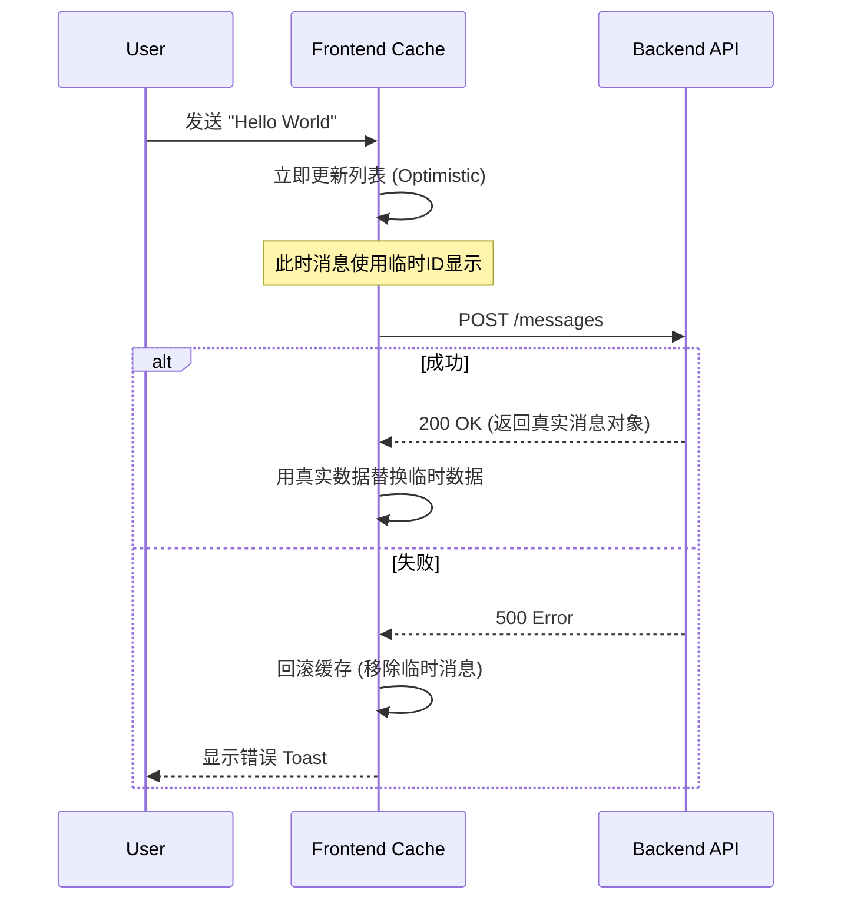

# 🎨 前端开发指南

Mew 的前端是一个响应迅速、实时交互的现代化 SPA（单页应用）。它采用 **React** 构建界面，利用 **WebSocket** 实现实时通讯，并遵循“关注点分离”的架构原则。本章将分析支撑 Mew 前端运行的工程结构与核心模式。

---

## 🏗️ 项目结构

为应对复杂的业务逻辑，Mew 采用 **Feature-First (按功能分组)** 架构。此架构将相关联的业务逻辑（组件、Hooks、模态框）聚合在同一模块下，提高了内聚性。

### 目录概览

```text
frontend/src/
├── 🧩 features/            # [核心] 业务功能模块
│   ├── auth/               # 🔐 认证：登录表单
│   ├── chat/               # 💬 聊天：消息流、输入框、内容渲染
│   ├── channels/           # 📢 频道：侧边栏列表、频道设置
│   ├── search/             # 🔍 搜索：搜索结果面板
│   ├── servers/            # 🖥️ 服务器：服务器切换、服务器设置
│   └── users/              # 👤 用户：用户资料、状态栏
├── 🧱 layout/              # [布局] 应用骨架
│   ├── modals/             # 全局模态框管理器与定义
│   └── Layout.tsx          # 应用的主界面外壳
├── 🛠️ shared/              # [共享] 通用基础设施
│   ├── constants/          # 共享常量 (如权限列表)
│   ├── hooks/              # 通用 Hooks (usePermissions, useSocketMessages)
│   ├── services/           # API 层 (axios 实例, socket 客户端)
│   ├── stores/             # Zustand 全局状态定义
│   ├── types/              # 全局 TypeScript 接口
│   └── utils/              # 通用工具函数 (日期格式化, 文件处理)
├── 🧪 mocks/               # MSW (Mock Service Worker) 测试拦截
├── 🚀 App.tsx              # 应用根组件，处理顶层逻辑
└── 🏁 index.tsx            # React 应用入口文件
```

> **💡 设计原则**：在 `features` 目录下，每个文件夹都是一个自包含的单元。例如，`chat` 功能拥有其私有的组件和 Hooks。只有当逻辑需要在多个功能间复用时，才会被提取到 `shared` 目录。

---

## 🧠 状态管理

Mew 将状态明确划分为两类，并分别治理：
1.  **客户端状态**：UI 交互状态（如弹窗开关、当前选中的 ID）。由 **Zustand** 管理。
2.  **服务端状态**：来自后端的数据（如消息列表、用户信息）。由 **TanStack Query** 管理。

### 1. 客户端状态 - Zustand
所有的 Store 定义均位于 `src/shared/stores/`。

**核心 Store 清单**：

| Store | 职责描述 | 关键 Action/State |
| :--- | :--- | :--- |
| `useAuthStore` | **身份凭证**。管理 Token 和当前用户对象，负责本地持久化。 | `setAuth`, `logout` |
| `useUIStore` | **导航与UI状态**。记录用户当前视图（服务器、频道）、成员列表/设置/搜索面板的开关状态。 | `setCurrentServer`, `setCurrentChannel`, `toggleMemberList`, `setSearchOpen` |
| `useModalStore` | **弹窗控制**。全局唯一的模态框控制器，管理当前激活的弹窗及其所需数据。 | `openModal`, `closeModal` |
| `usePresenceStore`| **在线状态**。通过 WebSocket 实时维护所有可见用户的在线状态。 | `setInitialState`, `updateUserStatus` |
| `useUnreadStore` | **未读消息**。维护未读频道的 ID 集合和被提及消息的 ID 集合，用于 UI 提示。 | `addUnreadChannel`, `removeUnreadChannel`, `addUnreadMention` |
| `useUnreadServerStore`| **服务器未读状态**。聚合频道未读状态，判断整个服务器是否有未读消息。 | `initializeNotifier` |
| `useHiddenStore` | **隐藏的DM频道**。持久化用户已关闭的私信频道列表，以便在 UI 中隐藏它们。 | `addHiddenChannel`, `removeHiddenChannel` |

**代码示例**：
```tsx
// src/shared/stores/store.ts
import { create } from 'zustand';

interface UIState {
  currentServerId: string | null;
  setCurrentServer: (id: string | null) => void;
  // ... 其他状态和操作
}

export const useUIStore = create<UIState>((set) => ({
  currentServerId: null,
  setCurrentServer: (id) => set({ currentServerId: id, currentChannelId: null }),
  // ...
}));

// src/features/servers/components/ServerList.tsx
import { useUIStore } from '../../../shared/stores/store';

function ServerList() {
  const { currentServerId, setCurrentServer } = useUIStore();
  // ...
}
```

---

### 2. 服务端状态 - TanStack Query
所有 API 请求均通过 [TanStack Query](https://tanstack.com/query/latest) 封装。它提供了**自动缓存**、**后台静默更新**和**竞态条件处理**能力。

#### 查询键 (Query Key) 策略
Query Key 是缓存的唯一标识，遵循 RESTful 风格的数组结构：

*   `['servers']`: 用户的所有服务器列表。
*   `['server', serverId]`: 单个服务器的详细信息。
*   `['channels', serverId]`: 特定服务器的频道列表。
*   `['dmChannels']`: 用户的私信频道列表。
*   `['messages', channelId]`: 特定频道的消息列表。
*   `['members', serverId]`: 特定服务器的成员列表。
*   `['roles', serverId]`: 特定服务器的角色列表。
*   `['categories', serverId]`: 特定服务器的频道分类列表。
*   `['permissionOverrides', channelId]`: 特定频道的权限覆盖设置。
*   `['messageSearch', serverId, query]`: 特定服务器内的消息搜索结果。
*   `['userSearch', query]`: 用户搜索结果。
*   `['user', userId]`: 单个用户的公开信息。
*   `['webhooks', channelId]`: 特定频道的 Webhook 列表。

#### ✨ 乐观更新
当用户发送消息时，UI 会立即显示该消息，无需等待后端确认，从而提供即时反馈。



**实现代码片段**:
1.  **查询数据 (`useQuery`)**:
    ```tsx
    // src/shared/hooks/useMessages.ts
    import { useQuery } from '@tanstack/react-query';
    import { messageApi } from '../services/api';

    export const useMessages = (serverId, channelId) => {
      return useQuery({
        queryKey: ['messages', channelId],
        queryFn: () => messageApi.list(serverId, channelId).then(res => res.data),
        enabled: !!channelId,
      });
    };
    ```

2.  **修改数据 (`useMutation`)** 并实现乐观更新:
    ```tsx
    // src/features/chat/messages/MessageInput.tsx (部分实现)
    const queryClient = useQueryClient();
    const user = useAuthStore.getState().user;

    const handleSendMessage = async (e: React.FormEvent) => {
        e.preventDefault();
        // ...校验逻辑

        // 1. 构造一个带临时ID的临时消息对象
        const tempId = new Date().toISOString();
        const newMessage: Message = {
            _id: tempId,
            channelId: channelId,
            authorId: user,
            content: contentToSend,
            createdAt: new Date().toISOString(),
            // ...
        };

        // 2. 乐观地更新UI
        queryClient.setQueryData(['messages', channelId], (oldData: Message[] | undefined) => {
            return oldData ? [...oldData, newMessage] : [newMessage];
        });

        // 清空输入框
        setInputValue('');

        try {
            // 3. 发送API请求
            await messageApi.send(serverId, channelId, { content: contentToSend });
            // 4. 请求成功后，使缓存失效以获取真实数据。
            //    WebSocket事件也会帮助同步，但invalidate可确保数据一致性。
            await queryClient.invalidateQueries({ queryKey: ['messages', channelId] });
        } catch (err) {
            // 5. 如果失败，回滚乐观更新
            queryClient.setQueryData(['messages', channelId], (oldData: Message[] | undefined) => {
                return oldData ? oldData.filter(m => m._id !== tempId) : [];
            });
            // 恢复输入框内容以便用户重试
            setInputValue(contentToSend);
        }
    };
    ```

---

## 🧩 插件化消息渲染系统

Mew 的聊天核心采用了**多态渲染**设计。这使得系统支持多种消息类型（如普通文本、图片、RSS 卡片），而无需修改核心渲染逻辑。

### 核心原理
后端返回的消息包含 `type` 和 `payload` 字段。前端的 `MessageContent` 组件充当**分发器**，根据 `type` 字段选择相应的渲染组件。

```tsx
// src/features/chat/messages/MessageContent.tsx (部分实现)
import React from 'react';
import { parseMessageContent } from '../../../shared/utils/messageParser';
import { AttachmentList } from './AttachmentList';

const MessageContent: React.FC<{ message: Message }> = ({ message }) => {
    const isRssCard = message.type === 'app/x-rss-card';

    // 1. 特殊类型渲染
    if (isRssCard && message.payload) {
        return ( /* RSS 卡片渲染逻辑 */ );
    }

    // 2. 默认渲染（文本 + 附件）
    return (
        <div>
            {message.content && (
                <p>{parseMessageContent(message.content)}</p>
            )}
            <AttachmentList attachments={message.attachments || []} />
        </div>
    );
};
```
该系统还利用 `src/shared/utils/messageParser.tsx` 将文本中的 `@mention` 语法转换为可交互的 `<Mention />` 组件。

### 实战：如何添加一个“投票”消息类型？

假设后端新增了一种消息类型：`app/x-poll`。

#### 1. 创建渲染器组件
在 `src/features/chat/messages/` 下新建 `PollMessage.tsx`。

```tsx
// src/features/chat/messages/PollMessage.tsx
import type { MessagePayload } from '@/shared/types';

interface PollMessageProps {
  payload: MessagePayload;
}

export function PollMessage({ payload }: PollMessageProps) {
  return (
    <div>
      <h3>{payload.question}</h3>
      <ul>
        {payload.options.map(option => (
          <li key={option.id}>{option.text}</li>
        ))}
      </ul>
    </div>
  );
}
```

#### 2. 注册渲染逻辑
在 `src/shared/types/index.ts` 中为 `MessagePayload` 接口添加新类型的定义，以获得类型安全。

```typescript
// src/shared/types/index.ts
export interface MessagePayload {
  // ... 已有类型
  question?: string;
  options?: { id: string; text: string }[];
}
```

修改 `src/features/chat/messages/MessageContent.tsx`，将新组件加入分发列表。

```tsx
// src/features/chat/messages/MessageContent.tsx
import { PollMessage } from './PollMessage'; // 1. 导入

const MessageContent: React.FC<{ message: Message }> = ({ message }) => {
    const isRssCard = message.type === 'app/x-rss-card';
    const isPoll = message.type === 'app/x-poll'; // 2. 添加类型检查

    if (isRssCard && message.payload) {
        // ... RSS 渲染逻辑
    }

    if (isPoll && message.payload) { // 3. 添加新的渲染分支
        return <PollMessage payload={message.payload} />;
    }

    // ... 默认渲染
};
```

**Done!** 现在，当 WebSocket 推送一条 `type: 'app/x-poll'` 的消息时，界面将自动渲染出投票卡片。