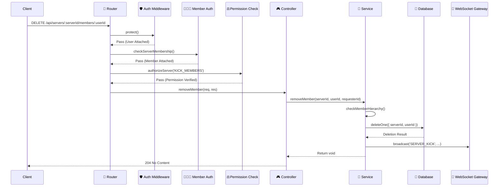

# ⚙️ 后端开发指南

Mew 的后端是系统的核心。它基于 `Node.js` + `Express` 构建，使用 `MongoDB/Mongoose` 进行数据持久化，并遵循以功能为中心的**分层架构**。

后端同时提供 REST API 与 WebSocket 网关，用于实时消息与状态同步；文件上传通过 S3 兼容存储（Garage）实现。

---

## 📂 项目结构

项目采用**以功能为中心 (Feature-First)** 的目录结构。与同一功能（如“用户认证”）相关的所有文件（路由、控制器、服务、模型、校验）都聚合在同一个文件夹内，以提升模块内聚度并降低跨模块的耦合。

```bash
backend/
├── src/
│   ├── api/                   # API 核心目录, 包含所有功能模块
│   │   ├── auth/              # 认证 (注册/登录)
│   │   ├── category/          # 频道分类
│   │   ├── channel/           # 频道 (服务器频道 & DM)
│   │   ├── invite/            # 服务器邀请
│   │   ├── member/            # 服务器成员
│   │   ├── message/           # 消息
│   │   ├── role/              # 角色
│   │   ├── search/            # 搜索
│   │   ├── server/            # 服务器
│   │   ├── upload/            # 文件上传
│   │   ├── user/              # 用户
│   │   └── webhook/           # Webhook
│   ├── config/                # 环境配置加载
│   ├── constants/             # 应用级常量 (如权限列表)
│   │   └── permissions.ts
│   ├── gateway/               # WebSocket (Socket.io) 网关
│   │   ├── events.ts          # SocketManager 单例
│   │   ├── handlers.ts        # 连接和事件处理器
│   │   ├── middleware.ts      # Socket 连接认证中间件
│   │   └── presence.service.ts# 用户在线状态服务
│   ├── middleware/            # Express 中间件
│   │   ├── auth.ts            # JWT 认证
│   │   ├── checkPermission.ts # 权限校验
│   │   ├── isServerOwner.ts   # 服务器所有者校验（部分管理路由使用）
│   │   ├── memberAuth.ts      # 服务器成员资格校验
│   │   ├── upload.ts          # Multer 上传配置
│   │   └── validate.ts        # Zod 数据校验
│   ├── utils/                 # 通用工具函数
│   │   ├── asyncHandler.ts     # 控制器异步错误包装
│   │   ├── db.ts              # 数据库连接
│   │   ├── errorHandler.ts    # 全局错误处理器
│   │   ├── errors.ts          # 自定义错误类型
│   │   ├── hierarchy.utils.ts # 角色和成员层级校验
│   │   ├── permission.service.ts # 权限计算核心服务
│   │   └── s3.ts              # S3 兼容上传与 CORS 初始化
│   ├── app.ts                 # Express 应用与路由配置
│   └── server.ts              # HTTP 和 Socket.io 服务器启动脚本
├── .env.example               # 环境变量示例文件
└── package.json
```

> **💡 每个功能模块的典型文件**：`*.routes.ts / *.controller.ts / *.service.ts / *.model.ts / *.validation.ts`，部分模块额外包含 `*.repository.ts`（封装复杂数据库查询）与 `*.test.ts`（Vitest 测试）。

---

## 🔄 请求生命周期

一个客户端请求在后端的数据流是明确且单向的。

以一个需要特定权限的操作为例（例如：踢出成员），其时序图如下：



1.  **🛡️ 认证 (`auth.ts`)**: 检查 `Authorization` 头中的 JWT，验证请求者身份。
2.  **🧑‍🤝‍🧑 成员资格 (`memberAuth.ts`)**: 确认请求者是目标服务器的成员。
3.  **⚖️ 授权 (`checkPermission.ts`)**: 校验请求者是否拥有执行该操作所需的权限（例如 `KICK_MEMBERS`）。
4.  **🎮 调度 (Controller)**: 控制器解析请求参数，调用相应的服务层方法。控制器自身不包含业务逻辑。
5.  **🧠 执行 (Service)**: 服务层包含核心业务逻辑。它执行必要的操作，例如进行**层级检查** (`hierarchy.utils.ts`) 以确保管理员不能踢出更高层级的成员，然后与数据库交互。
6.  **📡 广播 (Gateway)**: 操作完成后，服务层通过 `SocketManager` 广播事件，通知所有相关客户端状态已变更（例如，一个成员被踢出）。

---

## 🔐 认证与授权

系统严格区分“认证”（你是谁）和“授权”（你能做什么）。

### 1. 认证 (Authentication)
使用 **JWT (JSON Web Token)** 作为无状态身份令牌。
*   **REST API**: 客户端在每个请求的 `Authorization` Header 中携带 `Bearer <token>`。`middleware/auth.ts` 负责校验。
*   **WebSocket**: 客户端在 `socket.io` 连接握手的 `auth` 选项中提供 `token`。`gateway/middleware.ts` 在连接建立前进行校验，无效则拒绝连接。

### 2. 授权 (Authorization)
这是一个复合权限系统，其逻辑分散在几个关键文件中：

*   **权限定义 (`constants/permissions.ts`)**: 以 `const` 数组的形式定义了所有可用的权限字符串，如 `MANAGE_ROLES`, `SEND_MESSAGES`。
*   **权限计算 (`utils/permission.service.ts`)**:
    *   核心函数 `calculateEffectivePermissions` 结合服务器基础角色权限和特定于频道的权限覆盖（Overrides），计算出用户在某个特定频道中的最终有效权限集。
    *   服务器所有者 (`isOwner`) 和拥有 `ADMINISTRATOR` 权限的角色会绕过大部分计算，直接获得所有权限。
*   **权限校验中间件 (`middleware/checkPermission.ts`)**:
    *   提供 `authorizeServer` 和 `authorizeChannel` 两个中间件工厂。它们在路由层面对请求进行权限检查，如果权限不足则直接拒绝请求。
    *   `authorizeChannel` 内部区分 DM 与服务器频道：DM 场景下仅允许 `DM_PERMISSIONS` 中的权限（如发送消息、添加反应等）。
*   **层级校验 (`utils/hierarchy.utils.ts`)**:
    *   在服务层内部调用，用于处理管理操作。例如，`checkMemberHierarchy` 确保操作者的最高角色位置高于目标成员，防止低阶管理员管理高阶管理员。

---

## ✅ 数据校验

所有外部输入（`req.body`, `req.query`, `req.params`）都通过 **Zod** 进行校验。

*   **类型安全**: Zod Schema 可以直接推导出 TypeScript 类型，确保了数据在校验后是类型安全的。
*   **中间件集成**: `middleware/validate.ts` 提供了一个接收 Zod Schema 并返回 Express 中间件的函数，使校验逻辑与路由声明式地结合。

**应用示例**:
```typescript
// src/api/server/server.validation.ts
import { z } from 'zod';

export const createServerSchema = z.object({
  body: z.object({
    name: z.string().min(1, 'Server name is required'),
    avatarUrl: z.string().url('Invalid URL').optional(),
  }),
});

// src/api/server/server.routes.ts
import validate from '../../middleware/validate';
import { createServerSchema } from './server.validation';
import { protect } from '../../middleware/auth';
import { createServerHandler } from './server.controller';

// 路由在 `app.ts` 中注册，并已通过 `protect` 中间件
router.post('/', validate(createServerSchema), createServerHandler);
```

---

## 🧠 服务层 (Service Layer)

服务层是所有业务逻辑的所在地。

**设计原则**:
*   **框架无关**: 服务层代码不依赖 Express 的 `req` 和 `res` 对象，这使其逻辑纯粹、可复用，并易于进行单元测试。
*   **单一职责**: 每个服务聚焦于一个功能模块，处理数据库交互、调用其他服务以及广播事件。
*   **事件广播**: 当数据发生变更时（创建、更新、删除），服务层必须通过 `SocketManager` 广播一个 WebSocket 事件，以通知客户端进行实时更新。
*   **异常上抛**: 控制器使用 `asyncHandler` 包装，服务层通过抛出 `NotFoundError/ForbiddenError/...` 等自定义错误，由 `errorHandler` 统一转为 HTTP 响应。

**代码示例**:
```typescript
// src/api/server/server.service.ts
import Server from './server.model';
import { socketManager } from '../../gateway/events';

const serverService = {
  // ...
  async updateServer(serverId: string, data: Partial<CreateServerData>) {
    const server = await this.getServerById(serverId);
    Object.assign(server, data);
    await server.save();

    // 向服务器房间内的所有客户端广播 SERVER_UPDATE 事件
    socketManager.broadcast('SERVER_UPDATE', serverId, server);

    return server;
  },
  // ...
};
```

---

## 📡 实时通信 (Gateway)

`src/gateway/` 目录负责处理所有 WebSocket 通信。

*   **连接管理**:
    *   `middleware.ts`: 在每个 socket 连接建立时，使用 JWT 进行认证。
    *   `handlers.ts`: 认证成功后调用 `registerConnectionHandlers`。`joinUserRooms` 会让用户加入：
        - 所有 DM 频道房间（`channelId`）
        - 所在服务器的所有频道房间（`channelId`）
        - 服务器房间（`serverId`，用于服务器级事件）
        - 个人房间（`userId`，用于踢人等定向通知）
    *   WebSocket 侧也支持部分写操作，例如监听 `message/create`，创建成功后向频道房间广播 `MESSAGE_CREATE`。
*   **事件广播**:
    *   `events.ts`: `SocketManager` 是单例，封装 `socket.io` 服务器实例。服务层通过：
        - `socketManager.broadcast(eventName, roomId, payload)` 向房间广播
        - `socketManager.broadcastToUser(userId, eventName, payload)` 向个人房间定向发送
      以保持业务逻辑与实时通信解耦。
*   **在线状态**:
    *   `presence.service.ts`: 一个简单的内存服务，用于跟踪当前在线的用户。当用户连接和断开时，它会向所有客户端广播 `PRESENCE_UPDATE` 事件。

---

## 📎 文件上传（S3 兼容）

上传接口挂载在 `app.ts` 的 `/api/channels/:channelId/uploads`，对应 `src/api/upload/upload.routes.ts`：

- 使用 `authorizeChannel('ATTACH_FILES')` 做频道级权限检查。
- 使用 `multer` 的内存存储（`middleware/upload.ts`）接收单文件字段 `file`。
- `upload.controller.ts` 调用 `utils/s3.ts` 的 `uploadFile` 上传到 S3 兼容桶，并返回 `{ filename, contentType, key, size }`；其中 `key` 为对象存储中的文件名。

服务启动时（`src/server.ts`）会调用 `configureBucketCors()` 尝试为桶配置 CORS，以保证前端可直接访问对象存储资源。
