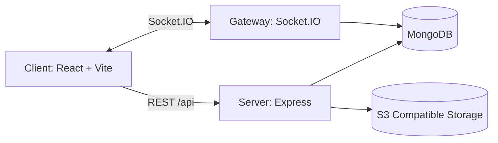
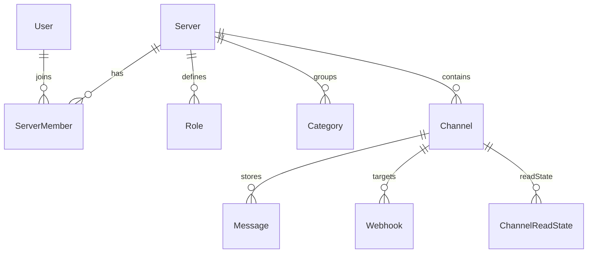

# 🏛️ 核心平台设计

Mew 的“核心平台”负责三件事：

- **身份与权限**：用户/服务器/角色/成员/频道的组织与授权。
- **消息与持久化**：消息写入 MongoDB，并支持分页拉取与搜索。
- **实时同步**：通过 Socket.IO 推送事件，让客户端“实时更新”而不是“频繁轮询”。

本文档聚焦架构与关键概念；具体字段、接口与事件请以参考文档为准：

- [<kbd>数据结构</kbd>](../core-api/data-structures.md)
- [<kbd>REST API</kbd>](../core-api/rest-api.md)
- [<kbd>WebSocket API</kbd>](../core-api/websocket-api.md)

---

## 🧩 系统组成

- **Client**：以 REST 拉取“资源状态”（服务器、频道、消息列表等），以 WebSocket 订阅“状态变化”（新消息、权限变化、频道更新等）。
- **Server**：Express 提供 REST API；Socket.IO 网关提供实时事件与少量上行写入（如 `message/create`）。
- **MongoDB**：主存储（用户、服务器、角色、频道、消息、邀请等）。
- **对象存储（可选）**：头像与附件上传；后端存储 `key`，对外返回时会补全为可访问的 `url`（见 `server/src/utils/s3.ts`）。

---

## 🗂️ 核心实体（概览）

平台层的主要对象关系（只保留关键关联）：

一些实现细节（以代码为准）：

- **User**：`isBot` 用于区分人类用户与 Bot 用户（见 `server/src/api/user/user.model.ts`）。
- **Channel**：`GUILD_TEXT`（服务器频道）与 `DM`（私信）共用一套模型（见 `server/src/api/channel/channel.model.ts`）。
- **ChannelReadState**：用于“已读/未读”能力，`ack` 接口会 upsert `lastReadMessageId`（见 `server/src/api/channel/readState.*`）。
- **Message**：支持 `type/content/payload/attachments/mentions/reactions` 等（见 `server/src/api/message/message.model.ts`）。
- **Webhook**：在某个频道下创建，公开执行端点使用 `webhookId + token`（见 `server/src/api/webhook/*`）。

---

## 🔐 权限模型（如何生效）

Mew 以“服务器角色 + 频道覆盖”的方式计算用户在某个频道的最终权限：

- **角色（Role）**：属于某个 Server，包含一组权限字符串（见 `server/src/constants/permissions.ts`）。
- **成员（ServerMember）**：在某个 Server 内拥有若干角色（`roleIds`）。
- **频道覆盖（permissionOverrides）**：在 Channel 上对“某个角色”或“某个成员”设置 allow/deny。
- **最终权限**：由后端计算并返回给客户端（例如频道列表会附带 `permissions` 数组），实现位于 `server/src/utils/permission.service.ts`。

实现上还有两点值得注意：

- **自我锁定保护**：更新频道权限覆盖时，会阻止普通成员提交导致自己失去 `MANAGE_CHANNEL` 的配置（见 `server/src/api/channel/channel.service.ts`）。
- **权限变更事件**：角色更新、成员角色更新、频道覆盖更新都会广播 `PERMISSIONS_UPDATE`，客户端通常需要失效缓存并重拉（见 `server/src/api/*/*.service.ts` 与 `server/src/gateway/events.ts`）。

---

## ⚡️ 实时模型（事件从哪来、发到哪）

Socket.IO 的房间划分（见 `server/src/gateway/handlers.ts`）：

- **频道房间**：用户会加入其可达的每个 `channelId`（DM 与服务器频道）。
- **服务器房间**：用户会加入其所属的每个 `serverId`（用于服务器级事件广播）。
- **个人房间**：用户会加入自己的 `userId`（用于定向通知，如 `SERVER_KICK`）。

事件广播策略（简化理解）：

- **频道级事件**（如 `MESSAGE_CREATE/MESSAGE_UPDATE`）→ 发到 `channelId` 房间。
- **服务器级事件**（如 `CHANNEL_UPDATE/CATEGORY_UPDATE/PERMISSIONS_UPDATE`）→ 发到 `serverId` 房间。
- **用户定向事件**（如 `SERVER_KICK/DM_CHANNEL_CREATE`）→ 发到 `userId` 房间（或 `broadcastToUser`）。

完整事件清单与 payload 结构见：[`core-api/websocket-api`](../core-api/websocket-api.md)。

---

## 🧾 消息协议（多态渲染）

Mew 的消息允许携带“渲染提示”：

- `type`：默认 `message/default`，也可以扩展为 `app/x-xxx`。
- `content`：纯文本降级展示。
- `payload`：结构化数据（由自定义渲染器使用）。
- `attachments`：上传后返回的元数据数组（`key` 会在返回给客户端时补成 `url`）。

这些字段的实际形态与补全规则请以：[`core-api/data-structures`](../core-api/data-structures.md) 为准。
