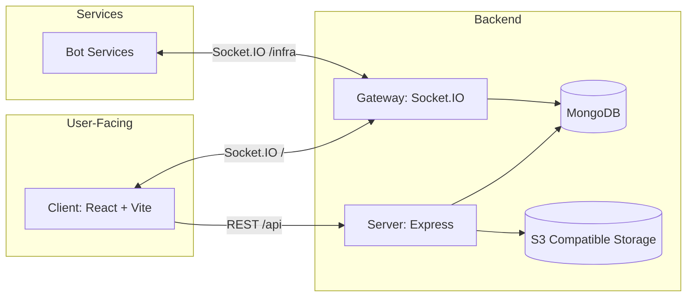
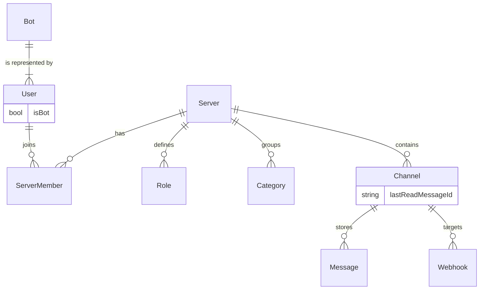

# 🏛️ 核心平台设计

Mew 的“核心平台”负责三件事：

- **身份与权限**：用户/服务器/角色/成员/频道的组织与授权。
- **消息与持久化**：消息写入 MongoDB，并支持分页拉取与搜索。
- **实时同步**：通过 Socket.IO 推送事件，让客户端“实时更新”而不是“频繁轮询”。

本文档聚焦架构与关键概念；具体字段、接口与事件请以参考文档为准：

- [<kbd>数据结构</kbd>](../core-api/data-structures.md)
- [<kbd>REST API</kbd>](../core-api/rest-api.md)
- [<kbd>WebSocket API</kbd>](../core-api/websocket-api.md)

---

## 🧩 系统组成

- **Client**：以 REST 拉取“资源状态”（服务器、频道、消息列表等），以 WebSocket 订阅“状态变化”（新消息、权限变化、频道更新等）。
- **Server**：Express 提供 REST API；Socket.IO 网关主要负责提供实时事件推送。客户端的写入操作（如发送消息、更新设置等）也通过 REST API 完成。
- **Bot Services**: 后端服务（例如 RSS 抓取器）通过一个专用的 `/infra` Socket.IO 命名空间连接到网关。它们使用共享密钥进行认证，并接收系统级指令（如配置更新），实现了与核心平台解耦的微服务架构。
- **MongoDB**：主存储（用户、服务器、角色、频道、消息、邀请等）。
- **对象存储**：头像与附件上传；后端存储 `key`，对外返回时会补全为可访问的 `url`。

---

## 🗂️ 核心实体（概览）

平台层的主要对象关系（只保留关键关联）：

一些实现细节（以代码为准）：

- **User**：`isBot` 字段用于区分不同类型的“机器人”用户和人类用户。平台中有三类用户：
    1.  **人类用户**：通过邮箱密码注册/登录。
    2.  **Bot 用户**：由 `Bot` 实体自动创建并关联，代表一个可编程的机器人应用。
    3.  **Webhook 用户**：由 `Webhook` 实体自动创建，仅用于代表该 Webhook 发送消息。
- **Bot**: 这是一个由人类用户创建和管理的实体，它拥有独立的 `accessToken` 用于登录、`serviceType` 用于关联后端服务、以及自定义配置 `config`。每个 `Bot` 实体都对应一个 `isBot: true` 的 `User` 实体。
- **Channel**：`GUILD_TEXT`（服务器频道）与 `DM`（私信）共用一套模型。
- **已读状态**：用于“已读/未读”能力，**在 `Channel` 模型上直接通过 `lastReadMessageId` 字段记录。客户端 `ack` 接口会更新此字段。**
- **Message**：支持 `type/content/payload/attachments/mentions/reactions` 等。
- **Webhook**：在某个频道下创建，它也会自动创建一个关联的 `User` 实体。其公开执行端点使用 `webhookId + token` 进行认证。

---

## 🔐 权限模型（如何生效）

Mew 以“服务器角色 + 频道覆盖”的方式计算用户在某个频道的最终权限：

- **角色（Role）**：属于某个 Server，包含一组权限字符串。
- **成员（ServerMember）**：在某个 Server 内拥有若干角色（`roleIds`）。
- **频道覆盖（permissionOverrides）**：在 Channel 上对“某个角色”或“某个成员”设置 allow/deny。
- **最终权限**：由后端计算并返回给客户端（例如频道列表会附带 `permissions` 数组）。

实现上还有几点值得注意：

- **服务器所有者与管理员特权**: 服务器所有者（`ServerMember.isOwner` 为 `true`）或**拥有 `ADMINISTRATOR` 权限角色的成员**会绕过所有权限计算，直接获得所有权限。
- **默认角色**: 创建服务器时，会自动创建 `@everyone` 角色作为基础权限，并为所有者创建一个拥有 `ADMINISTRATOR` 权限的 “Owner” 角色，确保所有者始终拥有最高权限。
- **自我锁定保护**：更新频道权限覆盖时，会阻止普通成员提交导致自己失去 `MANAGE_CHANNEL` 的配置。
- **权限变更事件**：角色更新、成员角色更新、频道覆盖更新都会广播 `PERMISSIONS_UPDATE`，客户端通常需要失效缓存并重拉。

---

## ⚡️ 实时模型（事件从哪来、发到哪）

Socket.IO 的房间划分（由后端实现，客户端隐式使用）：

- **频道房间**：用户会加入其可达的每个 `channelId`（DM 与服务器频道）。
- **服务器房间**：用户会加入其所属的每个 `serverId`（用于服务器级事件广播）。
- **个人房间**：用户会加入自己的 `userId`（用于定向通知，如 `SERVER_KICK`）。

事件广播策略（简化理解）：

- **频道级事件**（如 `MESSAGE_CREATE/MESSAGE_UPDATE`）→ 发到 `channelId` 房间。
- **服务器级事件**（如 `CHANNEL_UPDATE/CATEGORY_UPDATE/PERMISSIONS_UPDATE`）→ 发到 `serverId` 房间。
- **用户定向事件**（如 `SERVER_KICK/DM_CHANNEL_CREATE`）→ 发到 `userId` 房间。
- **服务专用命名空间**: 此外，平台还为后端服务（Bots）提供了一个专用的 `/infra` 命名空间。服务通过 `adminSecret` 和 `serviceType` 认证后加入对应的房间，用于接收系统级指令，如 `SYSTEM_BOT_CONFIG_UPDATE`。

完整事件清单与 payload 结构见：[`core-api/websocket-api`](../core-api/websocket-api.md)。

---

## 🧾 消息协议（多态渲染）

Mew 的消息允许携带“渲染提示”以实现丰富的卡片式消息：

- `type`：默认 `DEFAULT`，也可以扩展为自定义类型，**例如 `app/x-rss-card`、`app/x-twitter-card`、`app/x-bilibili-card` 等，客户端会根据此类型渲染不同的卡片组件。**
- `content`：纯文本内容，作为后备或与卡片共存。
- `payload`：结构化数据，供自定义渲染器使用。一个典型应用是 Webhook 消息，可以通过 `payload.overrides` 字段覆盖本次消息的 `username` 和 `avatarUrl`。
- `attachments`：上传后返回的元数据数组（`key` 会在返回给客户端时补全为 `url`）。

这些字段的实际形态与补全规则请以：[`core-api/data-structures`](../core-api/data-structures.md) 为准。
