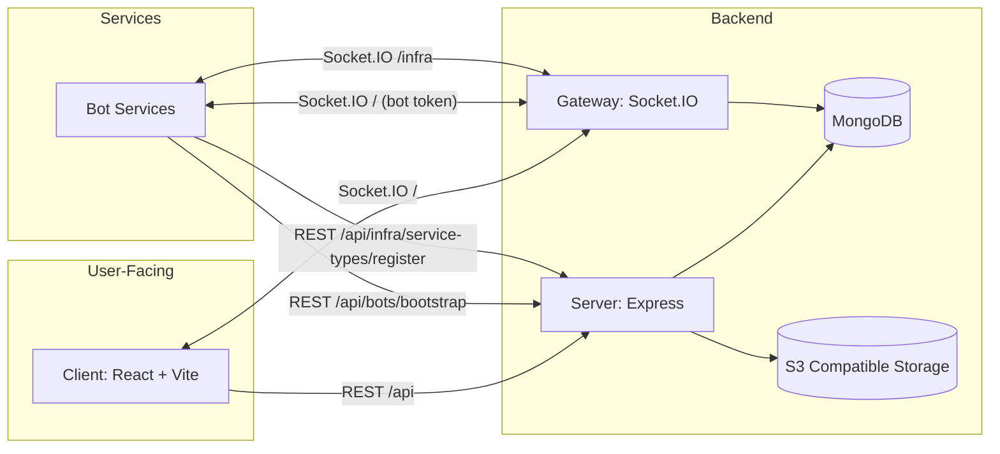
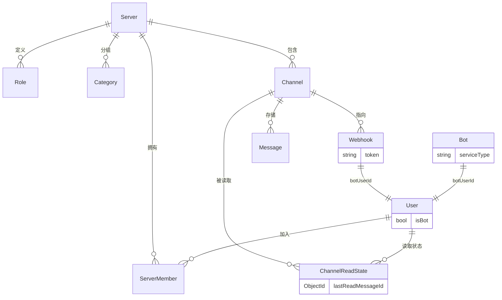

# 🏛️ 系统架构

Mew 的核心平台是一个集成了身份认证、消息持久化与实时通信的后端服务。其核心职责可以概括为三点：

-   **身份与权限**：管理用户、服务器、角色、成员和频道等核心实体，并处理复杂的权限计算。
-   **消息与持久化**：将消息等核心数据写入 MongoDB，并提供高效的分页拉取与搜索能力。
-   **实时同步**：通过 Socket.IO 将事件实时推送到客户端，确保所有用户界面都能即时更新。

:::info
本篇文档侧重于讲解系统架构与关键概念。
关于具体的字段、接口与事件定义，请参阅以下 API 参考文档：
-   [数据结构](../core-api/data-structures.md)
-   [REST API](../core-api/rest-api.md)
-   [WebSocket API](../core-api/websocket-api.md)
:::

---

## 🧩 系统组成

Mew 采用前后端分离架构，服务端在同一进程内同时提供 REST API 与 Socket.IO，并为插件运行时提供专用基础设施通道。

-   **客户端 (Client)**：通过 REST API 拉取初始状态（服务器、频道、历史消息等），并通过 WebSocket 订阅增量事件（如 `MESSAGE_CREATE`、`PERMISSIONS_UPDATE`）。
-   **服务端 (Server)**：`server/src/server.ts` 在同一个 HTTP Server 上挂载 Express 与 Socket.IO。消息写入以 REST 为主，落库后再通过网关广播。
-   **机器人服务 (Bot Services)**：以 `plugins` 运行时接入主平台，典型链路为：
    1.  通过受保护接口 `/api/infra/service-types/register` 注册或刷新 `serviceType` 元信息。
    2.  通过 `/api/bots/bootstrap` 拉取该 `serviceType` 下的 Bot 配置与 `accessToken`。
    3.  通过 Socket.IO `/infra` 命名空间（`adminSecret + serviceType`）上报服务在线状态。
    4.  使用 Bot `accessToken` 调用 `/api/auth/bot` 登录，并以 Bot 用户身份连接默认 Socket.IO 命名空间收发事件。
-   **MongoDB**：作为主数据库，存储所有核心数据。
-   **对象存储 (S3)**：用于存储用户头像、聊天附件等文件。服务端只存储文件的 `key`，在返回给客户端时会动态拼接成可访问的 `url`。

---

## 🗂️ 核心实体

平台主要对象之间的关系如下：

:::info 实现细节
-   **用户 (User)**：平台存在三类“身份来源”。
    -   **人类用户**：通过邮箱密码注册登录。
    -   **Bot 用户**：由 `Bot.botUserId` 关联，代表可编程 Bot 实例。
    -   **Webhook 用户**：由 `Webhook.botUserId` 关联，代表 Webhook 发送者身份。
-   **isBot 字段语义**：`isBot` 只区分“人类用户 vs 机器用户”；Bot 用户与 Webhook 用户都属于 `isBot: true`。
-   **机器人 (Bot)**：管理实体，包含 `serviceType`、`config`、`dmEnabled` 与访问令牌（存储为哈希/加密形式）。每个 `Bot` 至多关联一个 Bot 用户。
-   **频道 (Channel)**：服务器频道和私信共用同一套数据模型。
-   **已读状态**：用户的频道已读状态（`lastReadMessageId`）并非直接存储在频道对象上，而是由后端在请求时，根据 `ChannelReadState` 表动态聚合而来。
:::

---

## 🔐 权限模型

**Mew 的权限模型基于“服务器角色 + 频道权限覆盖”的方式计算用户在某个频道的最终权限。**

用户的最终权限是在后端动态计算出来的，计算逻辑如下：

1.  **基础权限**：首先获取用户在服务器内的所有 **角色 (Role)** 所赋予的权限总和。
2.  **权限覆盖**：然后，应用当前 **频道 (Channel)** 上的 **权限覆盖 (permissionOverrides)** 设置，这些覆盖可以针对特定角色或特定成员增加（allow）或移除（deny）权限。
3.  **最终权限**：计算出的最终权限集会随着频道信息一同返回给客户端。

:::info 实现细节
-   **管理员特权**：服务器所有者或拥有 `ADMINISTRATOR` 权限角色的成员，将绕过所有权限检查，始终获得所有权限。
-   **默认角色**：每个服务器在创建时都会自动生成一个 `@everyone` 角色作为所有成员的基础权限，以及一个拥有 `ADMINISTRATOR` 权限的 “Owner” 角色。
-   **DM 权限**：私信频道不走服务器角色体系，而是使用固定权限集合（`VIEW_CHANNEL`、`SEND_MESSAGES`、`ADD_REACTIONS`、`ATTACH_FILES`）。
-   **自我锁定保护**：当普通管理员修改频道权限时，系统会阻止其提交会导致自己失去 `MANAGE_CHANNEL` 权限的配置，防止误操作。
-   **权限变更事件**：任何可能影响用户权限的操作（如角色更新、成员角色变更、频道覆盖更新），都会广播 `PERMISSIONS_UPDATE` 事件，通知客户端刷新权限相关的缓存。
:::

---

## ⚡️ 实时通信模型

为了高效地广播事件，后端通过 Socket.IO 的房间（Room）机制对用户进行分组。客户端无需关心房间的具体实现，只需连接即可。

-   **频道房间 (Channel Room)**：用户会自动加入其所有相关频道的房间（包括私信和服务器频道），用于接收频道内的消息和事件。
-   **服务器房间 (Server Room)**：用户会加入自己所在的所有服务器的房间（以 `serverId` 标识），用于接收服务器级别的事件。
-   **个人房间 (User Room)**：每个用户会加入以自己 `userId` 命名的房间，用于接收定向通知（如被踢出服务器）。

基于以上房间划分，事件的广播策略非常清晰：

-   **频道级事件** (如 `MESSAGE_CREATE`) → 发送到对应的 `channelId` 房间。
-   **服务器级事件** (如 `CHANNEL_UPDATE`) → 发送到对应的 `serverId` 房间。
-   **用户定向事件** (如 `SERVER_KICK`) → 发送到对应的 `userId` 房间。

:::info 服务专用通信
除了用户通信，平台还为机器人运行时提供 `/infra` WebSocket 命名空间。运行时通过 `adminSecret + serviceType` 认证后，可在此通道上报在线状态，并触发对应 `serviceType` 下 Bot 用户在线状态同步。
:::

---

## 🧾 消息协议与多态渲染

为了实现丰富的卡片式消息（而不只是纯文本），Mew 的消息协议支持“多态渲染”。

-   `type`：一个字符串，默认为 `message/default`。客户端可以根据不同的 `type` 值渲染不同的组件。
-   `content`：纯文本内容，作为消息的后备展示或与卡片共存。
-   `payload`：一个 JSON 对象，用于存放结构化数据，供自定义卡片渲染器使用。
-   `attachments`：文件上传后，服务端返回的附件元数据数组。

:::info 已支持的卡片类型
目前仓库内已实现的前端卡片渲染器包括：
`app/x-rss-card`、`app/x-twitter-card`、`app/x-bilibili-card`、`app/x-instagram-card`、`app/x-pornhub-card`、`app/x-jpdict-card`、`app/x-claudecode-card`、`app/x-forward-card`，以及 `message/voice` 语音消息。
具体实现可参考 `client/src/features/chat-messages/components/MessageContent.tsx` 与 `client/src/features/chat-embeds/components/*`。
:::
