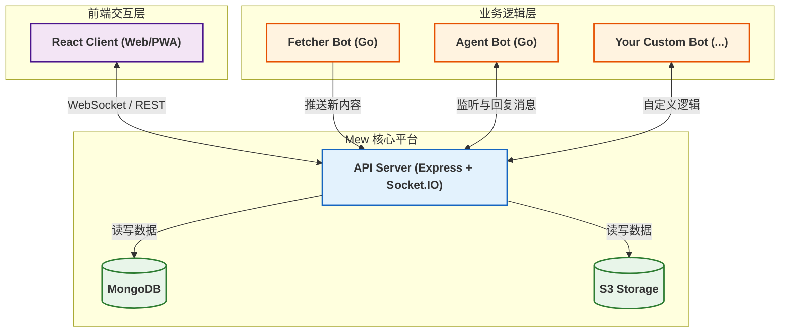

# 项目概览

**Mew** 是一款基于即时通讯（IM）作为核心交互方式的、可自托管的个人数字化中枢。

您可以将其简单理解为：

*   一个运行在无头 CMS 上的聊天客户端
*   或者，一个完全由您掌控的、Discord 风格的 IM 平台 + Bot 微服务

## 💡 解决了什么问题？

在如今的数字化生活中，我们常常面临着极大的上下文切换成本：

*  获取信息：我们需要在 X (原 Twitter)、RSS 阅读器、Bilibili 等多个应用间来回跳转。
*  思考记录：我们需要打开 Notion 或 Obsidian 等笔记工具。
*  与 AI 交互：我们还需要单独访问 ChatGPT 或其他 AI 服务。

:::info Mew 的核心理念
我们相信，如果能将信息流的输入、AI 的辅助处理以及知识的沉淀这三者，统一在一个基于时间轴的线性对话界面中，就可以极大降低用户的认知负担。

Mew 并不试图重新发明笔记软件或社交网络，它的目标是统一交互接口。
:::

## 🧩 核心设计哲学

### 1. 聊天即操作系统 (Chat as OS)

Mew 认为，对话流 (Stream) 是处理碎片化信息最自然的形态。

*  万物皆可为消息：无论是从爬虫抓取的文章，还是您随手记录的灵感，在系统中都被视为一条 `Message`。
*  交互皆为指令：您通过自然语言、`@Bot` 触发词或约定好的文本指令（如 `/echo ...`）与系统交互，而非点击层层嵌套的菜单。

### 2. 消息即资产 (Message as Asset)

Mew 项目的名称来源于 **Me**ssage **W**arehouse (消息仓库)，这代表了系统的核心：一个高可用、可检索的持久化存储层。

Mew 中的每一条数据都是您的个人数字资产，支持全文模糊搜索与分页拉取。

:::info 另一个名字来源
Mew 也取自传说中的宝可梦“梦幻”的名字。它拥有所有宝可梦的基因，象征着本项目作为基座，具备无限的可扩展性。
:::

### 3. 无业务逻辑的内核 (Unopinionated Core)

Mew 的核心平台设计极为简洁，它的唯一职责是维护 WebSocket 通道和数据存储。

所有的业务功能都由外部的Bot 插件 来提供。这确保了核心的稳定与功能的无限拓展。

---

## 🏗 系统架构：事件总线与微服务

Mew 拒绝构建一个庞大的单体应用，选择了事件总线 + 异构微服务的灵活架构，确保了核心的稳定与业务的敏捷。

### 1. Mew Platform

该层是系统的“总线”，一个纯粹的、与业务无关的消息传输和存储平台。

*  核心职责:
    *  消息路由：通过 `WebSocket` 和 `REST API` 在客户端与 Bot 之间进行实时消息分发。
    *  数据持久化：将所有消息存入 `MongoDB`，将文件存入 `S3` 对象存储。
    *  鉴权与状态管理：负责用户会话和连接状态的管理。
*  设计原则：平台层不理解消息内容的语义。它只负责确保消息安全、实时地传递到目标渠道，这使得平台代码高度稳定。

### 2. Bot Service

这是系统的“微服务集合”。所有的具体业务功能都由独立运行的 `Bot` 进程来执行。

*  核心职责:
    *  Fetcher Bot：高并发地轮询 X、RSS 等外部源，将数据清洗后推送至总线。
    *  Agent Bot：监听总线上的特定消息，按需调用 LLM 完成推理或工具调用，并将结果回写到总线。
*  设计原则：添加一个新功能只需部署一个新的 `Bot`，无需修改或重启核心平台。

---

## 🛠 技术栈选型

Mew 的技术选型旨在实现稳定性、灵活性与开发效率的平衡：

| 领域 | 技术栈 | 选型考量 |
| :--- | :--- | :--- |
|客户端| React, TanStack Query, Zustand |状态分离：Query 负责服务端缓存与同步，Zustand 负责轻量级 UI 状态。 |
|服务端| Node.js, Express, Socket.IO |高并发 I/O：Node.js 的事件循环机制在处理大量 WebSocket 长连接时具有天然优势。 |
|数据库| MongoDB |灵活文档模型：消息数据天然呈现非结构化/半结构化，与 JSON-like 的文档模型完美契合。 |
|对象存储| Garage (S3 兼容) |数据解耦：自托管对象存储，用于处理图片、视频等大文件，实现数据与逻辑分离。 |
|插件| Go |高性能与可靠性：作为独立进程运行，便于实现高并发抓取与可靠部署，与核心平台解耦。 |
|部署| Docker Compose |环境一致性：一键编排多服务环境，确保开发与生产环境一致。 |

---

## 🚀 下一步

Mew 不仅仅是一个工具，更是一个可编程的个人环境。
如果您已准备好掌控自己的数字信息流，请继续阅读：

*   [**快速开始**](./getting-started) - 只需 5 分钟，轻松部署您的第一个 Mew 实例。
*   [**API 参考**](../core-api/rest-api) - 学习如何编写您的第一个 Bot 服务。